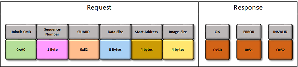
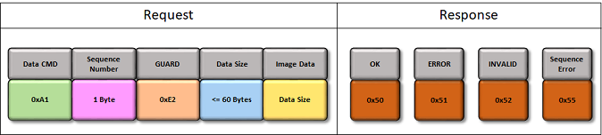
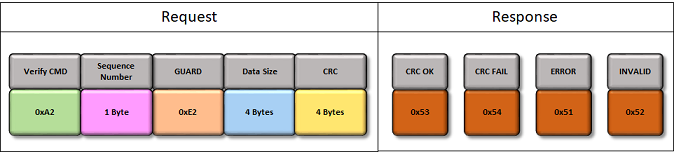

# CAN Bootloader Protocol

**Request Packet**

The can bootloader protocol as shown in below figure is common for all the supported commands.

**Command**

-   Indicates the command to be processed. Each command is of 1 Byte width

-   Below are the supported commands

|Command Type|Command Code|Description|
|------------|------------|-----------|
|Unlock|0xA0|Used to calculate application start address and end address|
|Data|0xA1|Used to send the image data|
|Verify|0xA2|Used to verify the image data sent and programmed|
|Reset|0xA3|Used to trigger a reset to run the application|
|Bank Swap and reset|0xA4|Used to Swap the bank and trigger a reset to run the application|

**Sequence Number**

-   Indicates the packet sequence number.

-   For data command the sequence number has to be incremented by 1 for every data packet. Bootloader checks the sequence number once data packet is recieved. If there is a mismatch it sends a sequence error response

-   As the sequence number is of 1 Byte width, once it reaches to a value of 255 it restarts from zero

**GUARD**

-   The Guard value must be a constant value of **0xE2**

-   This value provides protection against spurious commands

-   Bootloader always checks for the Guard value on packet reception and proceeds further accordingly

**Data Size**

-   This field indicates the number of data bytes to be received

-   This value varies for different commands

**Data**

-   Contains the actual Data to be processed based on the command

-   Length of the data to be received is indicated by Data Size field

-   All data words must be sent in a little-endian \(LSB first\) format

**Response Codes**

Bootloader will send a **single character response code** in response to each command. Sequential commands can only be sent after the response code is received for a previous command, or after 100 ms timeout without a response.

|Response Type|Response Code|Description|
|-------------|-------------|-----------|
|OK|0x50|Command was received and processed successfully|
|Error|0x51|There were errors during the processing of the command|
|Invalid|0x52|Invalid command is received|
|CRC OK|0x53|CRC verification was successful|
|CRC Fail|0x54|CRC verification failed|
|SEQ ERROR|0x55|Sequence number mismatch for Data command|

**Unlock Command**

The Unlock Command sequence is as shown in below figure with corresponding responses.

-   Unlock command must be issued before the first Data command

    -   It is used to calculate application start address and end address

    -   This information will be used to validate if the addresses sent are within the range of flash memory

-   Number of bytes of data to be received is 8 Bytes \(Start Address + Image Size\)

-   Start Address

    -   It is the application Start Address of the flash memory

    -   It is device dependent and should be always greater than or equal to the bootloader end address

    -   It must be aligned at an Erase Unit Size boundary, which is also device dependent

    -   To upgrade the bootloader itself this value must be set to 0 **\(For CORTEX-M based MCUs\)**

-   Image size must be in increments of Erase Unit bytes which is also device dependent

**Data Command**

The Data Command sequence is as shown in below figure with corresponding responses.

-   Data command is used to send the image data

-   The maximum packet length received by CAN bootloader is 64Bytes. The Data size <= 60Bytes as we have 4 bytes reserved for packet header

**Verify Command**

The Verify Command sequence is as shown in below figure with corresponding responses.

-   Verify command is used to verify the image data sent and programmed

-   Image CRC is a standard IEEE CRC32 with a polynomial of **0xEDB88320**

-   Internal CRC is calculated based on the values actually read from the Flash memory after programming, so it verifies the whole chain.

-   Image CRC is calculated over the previously unlocked region.

**Reset Command**

The Reset Command sequence is as shown in below figure with corresponding responses.

-   Reset command is used to exit the bootloader and run the application

-   It is necessary if the host has no control over the reset pin. It can also be useful even if host has control over the Reset

**Bank Swap and Reset Command**

The Bank Swap and Reset Command sequence is as shown in below figure with corresponding responses

-   This command is enabled only when **Fail safe update** feature is selected for bootloader and the device has support for Dual Bank update

-   Bank Swap and Reset command is used to **Swap the inactive bank to active bank** and trigger a reset to exit the bootloader and run the new application programmed in the inactive bank

**Parent topic:**[How the CAN Bootloader library works](GUID-13849322-051C-4B2E-9CD0-632F6D89DDB0.md)

