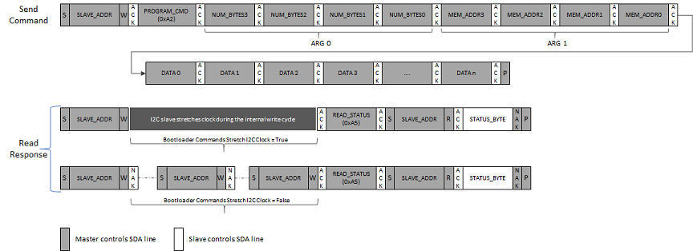

# I2C Bootloader Protocol

Each command argument is of 4 bytes and must be sent in big-endian \(MSB first\) format.

**Unlock Command \(0xA0\)**

-   Unlock command is used to specify the application start address and size of the application. Unlock command must be issued before issuing any other command.

-   **Payload:**

    -   Arg 0 - Application start address. The start address is device dependent and must be aligned to an Erase Unit boundary which is also device dependent.

    -   Arg 1 - Application size. It must be rounded off to the nearest erase unit size .

-   The memory address range specified in Unlock command will be used to validate the addresses sent for other commands. The memory address specified by all other commands must lie within the address range specified for the Unlock command.

-   Bootloader will calculate CRC over the entire range of memory specified by the Unlock command

**Erase Command \(0xA1\)**

-   Erase command erases a flash page as specified by the Erase Page Address argument

-   **Payload:**

    -   Arg 0 - Starting memory address of the flash page being erased.

-   The flash page being erased must lie within the address range specified by the Unlock command else the bootloader will NAK the command and the INVALID ADDRESS error bit will be set in the status byte.

-   If the command is accepted successfully, the bootloader will set the BUSY bit in the status byte. The host application must poll the status byte and ensure that the command is completed successfully \(status byte indicates bootloader is not busy and no error bits are set\) before issuing a new command.

-   **Note:** Depending on the value specified for **Bootloader Commands Stretch I2C Clock**, the bootloader may either stretch the I2C clock or respond with NAK while it is busy

**Program Command \(0xA2\)**

-   Program command is used to send the image data

-   **Payload:**

    -   Arg 0: Number of bytes to program. It must be a multiple of the flash page size. Depending on the value specified, one or more flash pages within the erase unit can be programmed. For example, if the erase row size is 256 bytes and program page size is 64 bytes, the number of bytes to program can either be 64, 128, 192 or 256.

    -   Arg 1: Program Memory Address. It must be aligned to the start address of the flash page being programmed.

-   The flash page being programmed must lie within the address range specified by the Unlock command; else the bootloader will NAK the command and the INVALID ADDRESS error bit will be set in the status byte.

-   If the command is accepted successfully, the bootloader will set the busy bit in the status byte. The host application must poll the status byte and ensure that the command is completed successfully \(status byte indicates bootloader is not busy and no error bits are set\) before issuing a new command.

-   The bootloader host application must ensure that the flash page being programmed is erased before issuing the Program Command

-   **Note:** Depending on the value specified for **Bootloader Commands Stretch I2C Clock**, the bootloader may either stretch the I2C clock or respond with NAK while it is busy.

**Verify Command \(0xA3\)**

-   Verify command is used to verify the programmed application image.

-   **Payload:**

    -   Arg 0: Application Image CRC. CRC is a standard IEEE CRC32 with a polynomial of **0xEDB88320**

-   The bootloader host application must calculate the CRC of the application image over the entire memory range specified in the Unlock command and provide it to the bootloader. The CRC is a standard IEEE CRC32 with a polynomial of 0xEDB88320.

-   The bootloader upon receiving the Verify command, calculates the CRC over the range of addresses specified by the Unlock command by reading the flash memory contents and compares it with the received CRC value.

-   If the command is accepted successfully, the bootloader will set the busy bit in the status byte. The host application must poll the status byte and ensure that the CRC verification is successful \(status byte indicates bootloader is not busy and no error bits are set\) before issuing the Reset Command.

-   If the calculated CRC and received CRC values do not match, the CRC\_ERROR bit is set in the Status byte.

-   **Note:** The bootloader will stretch the I2C clock while it is busy verifying the application image.

**Reset Command \(0xA4\)**

-   Reset command is used to exit the bootloader and run the application. The system takes a reset after receiving the Reset Command

**Read Status Command \(0xA5\)**

-   Returns the bootloader status. The bootloader status can be read any time.

**Flash Bank Swap and Reset Command \(0xA6\)**

-   Resets the device and swaps the flash bank.

-   This command is enabled only when **Fail safe update feature** is selected for bootloader and the device has support for Dual Bank update

-   Bank Swap and Reset command is used to Swap the inactive bank to active bank and trigger a reset to exit the bootloader and run the new application programmed in the inactive bank

**Parent topic:**[How the I2C Bootloader library works](GUID-EFEE222D-BE1D-42F5-A032-C966B5DA09C2.md)

