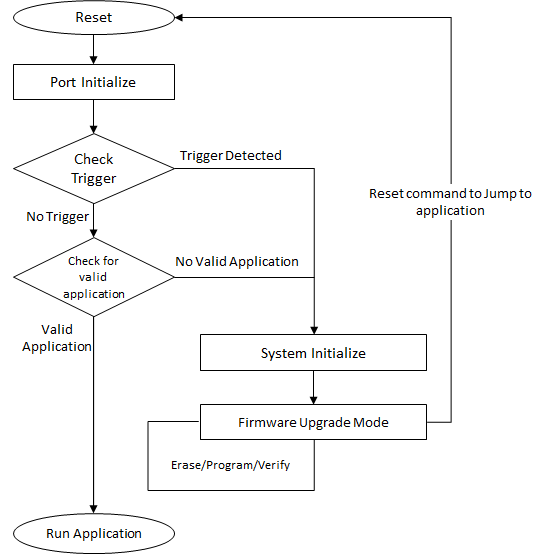

# CAN Bootloader system level execution flow

**Basic Bootloader system level execution flow**

-   The Bootloader code starts executing on a device Reset

-   If there are no conditions to enter the firmware upgrade mode, the Bootloader starts executing the user application

    -   Refer to Bootloader Trigger Methodsfor different conditions to enter firmware upgrade mode

-   The Bootloader performs Flash erase/program operations while in the firmware upgrade mode

\>

-   **[Bootloader Trigger Methods](GUID-171634E3-4F7B-4CBD-BCE9-EC2BB22BF2AD.md)**  

-   **[CAN Bootloader Firmware Update mode execution flow](GUID-ECD677F9-D618-4232-8A1E-9C488FE07E6E.md)**  

**Parent topic:**[CAN Bootloader](GUID-67381576-E9AA-4E3C-BE36-D32966B8E034.md)

