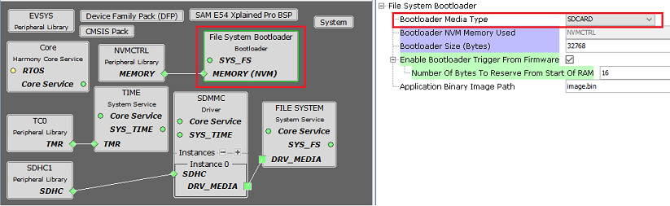
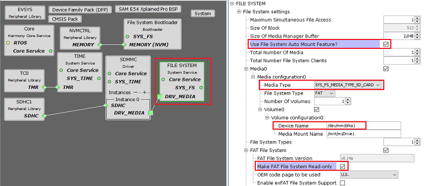
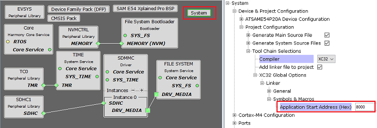
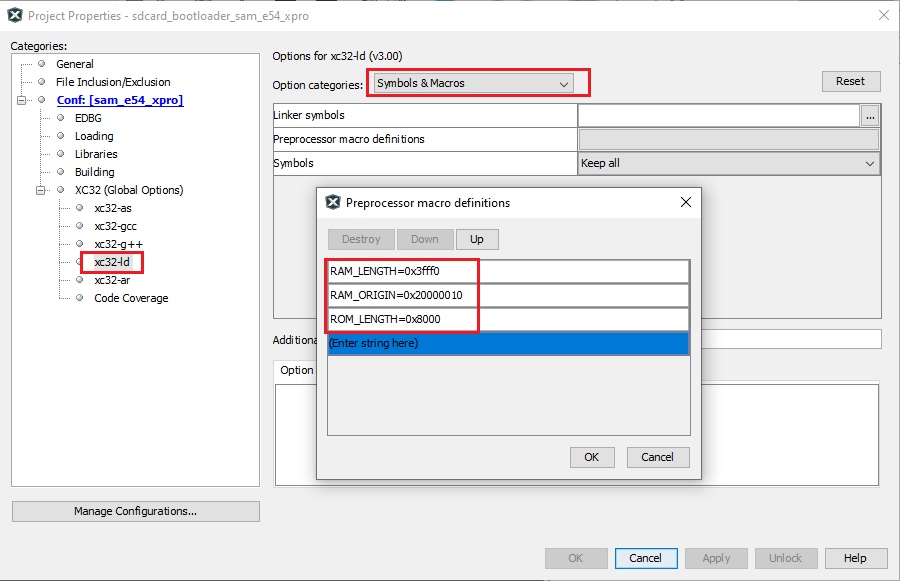

# SD Card Bootloader Configurations

**Bootloader Specific User Configurations**

-   **Bootloader Media Type:**

    -   Change the Media Type to **SDCARD**

-   **Bootloader NVM Memory Used:**

    -   Specifies the memory peripheral used by bootloader to perform flash operations

    -   The name of the peripheral will vary from device to device

-   **Bootloader Size \(Bytes\):**

    -   Specifies the maximum size of flash required by the bootloader

    -   This size is calculated based on Bootloader type and Memory used

    -   This size will vary from device to device and should always be aligned to device erase unit size

-   **Enable Bootloader Trigger From Firmware:**

    -   This Option can be used to Force Trigger bootloader from application firmware after a soft reset. It does so by reserving the specified number of bytes in SRAM from the start of the RAM. The reserved memory is updated by the application with a pre-defined pattern. The bootloader firmware in the bootloader\_Trigger\(\) routine, can check the reserved memory for the pre-defined pattern and enter bootloader mode if the pattern matches.

    -   **Number Of Bytes To Reserve From Start Of RAM:**

        -   This option adds the provided offset to RAM Start address in bootloader linker script.

        -   Application firmware can store some pattern in the reserved bytes region from RAM start for bootloader to check at reset in bootloader\_Trigger\(\) function

-   **Application Binary Image Path:**

    -   Application binary image file name with path. If only file name is mentioned bootloader will try to open the file from the root directory

    -   **Default: image.bin**

    -   Can be used to specify custom paths based on requirement

        -   **Example: dir1/dir2/app.bin**

**File System Configurations**

-   **Use File System Auto Mount Feature:**

    -   Enabled by default when File System Bootloader is added

-   **Media Type:**

    -   Change the Media Type to **SYS\_FS\_MEDIA\_TYPE\_SDCARD**

-   **Make FAT File System Read-only:**

    -   Enabled by default when File System Bootloader is added as there are no write operations to be done

    -   Enabling this option also saves significant amount of flash memory

**Bootloader System Configurations**

-   **Application Start Address \(Hex\):**

    -   Start address of the application which will programmed by bootloader

    -   This value is filled by bootloader when its loaded which is equal to the bootloader size. It can be modified as per user need

    -   This value will be used by bootloader to Jump to application at device reset

**Bootloader Linker Pre Processor Macros for CORTEX-M based MCUs**

-   Based on the configurations the above linker pre processor macros will be generated in MPLAB X xc32-ld settings

    -   ROM\_LENGTH specifies the size of the bootloader

-   **[Bootloader linker configurations for MIPS based MCUs](GUID-F222E4C9-8DCD-4917-A147-2EABBE9969F1.md)**  

-   **[Bootloader Sizing And Considerations](GUID-7E38E7D5-AB6E-4C67-A6E6-7F3BA58FDEF3.md)**  

**Parent topic:**[File System Bootloader](GUID-B40F9A07-D16A-42CF-8121-B52B5BDD7685.md)

