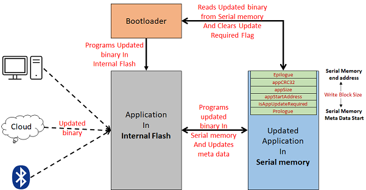

# How the Serial Memory Bootloader library works

The Serial Memory Bootloader firmware communicates with the serial memory to receive application firmware

-   Resides from

    -   The starting location of the flash memory region for CORTEX-M based MCUs

    -   The starting location of the Boot flash memory region or Program Flash memory region for MIPS based MCUs devices

-   The Bootloader performs flash erase/program/verify operations with the binary read from serial memory while in the firmware upgrade mode

    -   The binary received is only of the application to be programmed

    -   Bootloader always performs flash operation from the address for application binary being received

    -   The application can use the entire flash memory region starting from the end of bootloader space

-   Calls **SYS\_DeInitialize\(\)** before jumping to the application space

-   **Note: At first bootup either the serial memory should already have the application to be bootloaded or the application to be bootloaded has to be programmed along with bootloader using the external programmer or debugger.**


**Bootloader and Serial Memory Meta Data**

```c
/* Structure to store the Meta Data of the application binary for bootloader
 * Note: The order of the members should not be changed
 */
typedef struct
{
    /* Used to Validate the Meta Data itself*/
    uint32_t prologue;

    /* Flag to indicate if a firmware update is required
     * 0xFFFFFFFF --> Update Required. Set by Serial Memory programmer after programming
     *                the image in Serial memory
     * 0x00000000 --> Update Completed. Changed by bootloader after programming
     *                the image from Serial memory to internal flash
     */
    uint32_t isAppUpdateRequired;

    /* Application Start address */
    uint32_t appStartAddress;

    /* Size of the application binary */
    uint32_t appSize;

    /* CRC32 value for the application binary */
    uint32_t appCRC32;

    /* Used to Validate the Meta Data itself*/
    uint32_t epilogue;

} APP_META_DATA;

```

-   The above meta data for application has to be stored in last page of serial memory required by bootloader

-   Bootloader reads this meta data to get details of the application binary being received and then performs the programming operation accordingly

-   Once programming is completed, it generates CRC32 on programmed space of internal flash and verifies it against the **appCRC32** stored in Meta data

-   Once verification is completed it clears the **isAppUpdateRequired** flag and then performs reset to jump to application




-   **[Basic Memory layout for CORTEX-M based MCUs](GUID-8DC24BD7-3112-401A-A207-3A1FC3A416AB.md)**  

-   **[Basic Memory layout for MIPS based MCUs](GUID-C2AA810E-4247-4971-99CA-8F3D78A9DD2F.md)**  


**Parent topic:**[Serial Memory Bootloader](GUID-AC20F067-9388-42CD-A49D-05496869CC4D.md)

