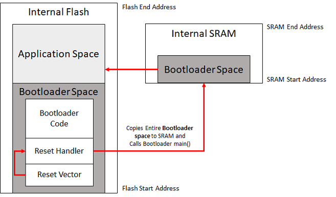

# UART Bootloader

The UART bootloader Library can be used to upgrade firmware on a target device without the need for an external programmer or debugger.

**Features**

-   Supported on CORTEX-M and MIPS based MCUs

-   Uses Harmony 3 UART PLIB to communicate resulting in **smaller bootloader size**

-   Supports Fail Safe update

-   Takes **Binary File** as input

-   Uses **command line host script** to receive binary from Host PC

**Running From SRAM \(For SAM Devices\)**

-   Supports simultaneous Flash memory write and reception of the next block of data, Achieved by loading bootloader into flash and running from SRAM

-   Has capability to self update as it is running from SRAM

-   At reset the bootloader Reset handler copies the entire bootloader firmware into SRAM from Start location and start executing from SRAM

-   Once the application is called from bootloader, applications startup code takes control over SRAM and starts executing

**UART Bootloader Block Diagram**

-   **Input Task:**

    -   This task is responsible for receiving data from Embedded Host through the UART communication interface

    -   The task keeps polling for data to be received when bootloader is in idle mode

    -   The task also validates the incoming packet from host with expected header information

    -   Once the packet reception is completed it gives control to **Command Task**

-   **Command Task:**

    -   This task processes the commands received from **Input Task** and provides response back to host accordingly

    -   If the command received is a **Data command** it gives control to the **Flash Task**

-   **Flash Task:**

    -   This task is responsible to program the internal flash memory with data packet received

    -   The task uses the NVM peripheral library to perform the Unlock/Erase/Write Operations

    -   The task also invokes **Input Task** in parallel to receive next packet while waiting for the flash operation to complete for **CORTEX-M based MCUs**

-   **[How the UART Bootloader library works](GUID-03E67D01-3442-4A5E-A1D7-8C5EF776D876.md)**  

-   **[UART Bootloader system level execution flow](GUID-C34FDEFB-E3B0-4C31-9702-E3C457A1B6C7.md)**  

-   **[UART Bootloader Configurations](GUID-02519565-B72E-496D-8153-E00F011D9130.md)**  

-   **[Configurations for the application to be bootloaded](GUID-81FF31CA-1770-4876-8AAB-FA0015038359.md)**  

-   **[UART Bootloader Library Interface](GUID-3C3BD693-4F3C-46C4-B4FC-517A4BA1DEFA.md)**  

-   **[UART Bootloader Host Script Help](GUID-8BE0388C-8563-4ED8-9C17-F3FE7B88FE51.md)**  

-   **[Debugging Bootloader and Application to be bootloaded](GUID-05CA35ED-C84A-4F88-AAC1-F37D8F6EFEF4.md)**  

**Parent topic:**[MPLAB® Harmony Bootloader Library](GUID-21B27208-104A-468D-8F94-F58D432AB08C.md)

