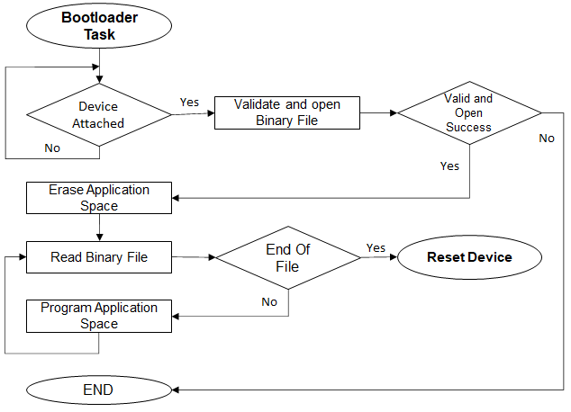

# File System Bootloader Firmware Update mode execution flow

**Bootloader Task Flow**

-   Erases the Flash memory

-   Programs the binary into Flash memory

-   Jumps to the Application

**USB Host MSD Bootloader Task Flow**

**SD Card and Serial Memory Bootloader Task Flow**

**Parent topic:**[File System Bootloader system level execution flow](GUID-BF0771C3-3A36-4B29-9CD4-E9D7F6EC193F.md)

