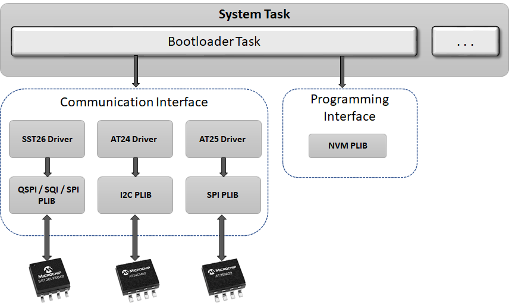

# Serial Memory Bootloader

The Serial Memory bootloader Library can be used to upgrade firmware on a target device without the need for an external programmer or debugger.

**Features**

-   Supported on CORTEX-M and MIPS based MCUs

-   Uses Harmony 3 Serial Memory drivers to communicate with the associated serial memory. Below are the serial memory drivers used

    -   **I2C EEPROM:** AT24 Driver

    -   **SPI EEPROM:** AT25 Driver

    -   **SPI Flash:** SST26 Driver

    -   **QSPI Flash:** SST26 Driver

**Serial Memory Bootloader Block Diagram**

-   **Bootloader Task**

    -   Uses Serial Memory driver to reads the application binary stored in serial memory.

    -   Erases the Internal Flash memory

    -   Programs the read binary into Flash memory

    -   Verifies the programed application

    -   Jumps to the Application

    -   Runs in Cooperative mode with other tasks in the system

-   **[How the Serial Memory Bootloader library works](GUID-7AD52CC2-469F-4BD3-B979-52AF12BE34FA.md)**  

-   **[Serial Memory Bootloader execution flow](GUID-A0B4A3D8-1681-4774-AF4E-2F076263772A.md)**  

-   **[Serial Memory Bootloader Configurations](GUID-1FC4D617-90BB-496E-9BDC-A7D91BC7BBA2.md)**  

-   **[Configurations for the application to be bootloaded](GUID-81FF31CA-1770-4876-8AAB-FA0015038359.md)**  

-   **[Serial Memory Bootloader Library Interface](GUID-26BD4D0B-9547-4AD1-A013-94DCFFC90933.md)**  

-   **[Debugging Bootloader and Application to be bootloaded](GUID-E3F876E5-BE9E-426E-8DC4-E03EF71E8605.md)**  

**Parent topic:**[MPLAB® Harmony Bootloader Library](GUID-21B27208-104A-468D-8F94-F58D432AB08C.md)

