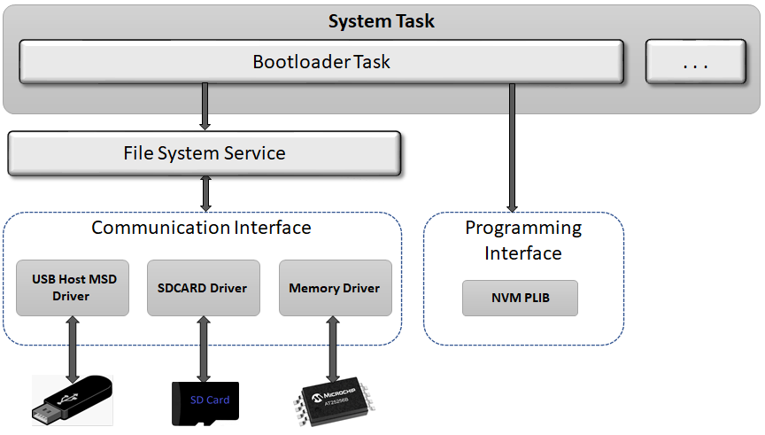

# File System Bootloader

The File System bootloader library can be used to upgrade firmware on a target device without the need for an external programmer or debugger.

**Features**

-   Supported on CORTEX-M and MIPS based MCUs

-   Uses Harmony 3 File System Service to communicate with underlying media

-   Takes **Binary File** as input

**File System Bootloader Block Diagram**

-   **Bootloader Task**

    -   Uses File System Service to read the Binary file from the media

    -   Erases the Flash memory

    -   Programs the binary into Flash memory

    -   Jumps to the Application

    -   Runs in Cooperative mode with other tasks in the system

-   **Supported Medias:**

    -   **USB Host MSD**

    -   **SDCARD**

    -   **Serial Memory**

        -   **I2C EEPROM**

        -   **SPI EEPROM**

        -   **SPI Flash**

        -   **QSPI Flash**

-   **[How the File System Bootloader library works](GUID-90369DFF-8F80-4CB1-9536-FD4A4EA4B0DD.md)**  

-   **[File System Bootloader system level execution flow](GUID-BF0771C3-3A36-4B29-9CD4-E9D7F6EC193F.md)**  

-   **[USB Host MSD Bootloader Configurations](GUID-D70E2C74-59C6-4741-9FCA-CD7EBF5AED80.md)**  

-   **[SD Card Bootloader Configurations](GUID-7325E59D-D429-4305-9AFC-5BE10EE38EE2.md)**  

-   **[Serial Memory Bootloader Configurations](GUID-2A66A563-5A79-49DA-AE0F-90CA19F807EA.md)**  

-   **[Configurations for the application to be bootloaded](GUID-81FF31CA-1770-4876-8AAB-FA0015038359.md)**  

-   **[File System Bootloader Library Interface](GUID-A1E794F4-0659-4283-AF6A-3642708A0F7D.md)**  

-   **[Debugging Bootloader and Application to be bootloaded](GUID-E3F876E5-BE9E-426E-8DC4-E03EF71E8605.md)**  

**Parent topic:**[MPLAB® Harmony Bootloader Library](GUID-21B27208-104A-468D-8F94-F58D432AB08C.md)

