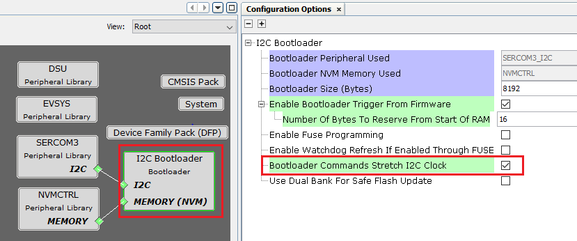
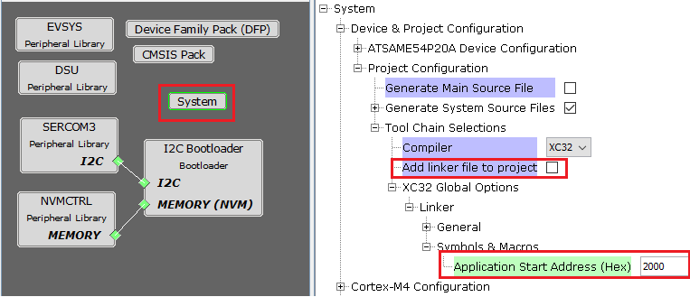

# I2C Bootloader Configurations

**Bootloader Specific User Configurations**

-   **Bootloader Peripheral Used:**

    -   Specifies the communication peripheral used by bootloader to receive the application

    -   The name of the peripheral will vary from device to device

-   **Bootloader NVM Memory Used:**

    -   Specifies the memory peripheral used by bootloader to perform flash operations

    -   The name of the peripheral will vary from device to device

-   **Bootloader Size \(Bytes\):**

    -   Specifies the maximum size of flash required by the bootloader

    -   This size is calculated based on Bootloader type and Memory used

    -   This size will vary from device to device and should always be aligned to device erase unit size

-   **Enable Bootloader Trigger From Firmware:**

    -   This Option can be used to Force Trigger bootloader from application firmware after a soft reset. It does so by reserving the specified number of bytes in SRAM from the start of the RAM. The reserved memory is updated by the application with a pre-defined pattern. The bootloader firmware in the bootloader\_Trigger\(\) routine, can check the reserved memory for the pre-defined pattern and enter bootloader mode if the pattern matches.

    -   **Number Of Bytes To Reserve From Start Of RAM:**

        -   This option adds the provided offset to RAM Start address in bootloader linker script.

        -   Application firmware can store some pattern in the reserved bytes region from RAM start for bootloader to check at reset in bootloader\_Trigger\(\) function

-   **Bootloader Commands Stretch I2C Clock:**

    -   This Option is used to decide if bootloader stretches clock when it is busy or sends NAK. Enabling this option stretches the I2C clock when the bootloader is busy with the internal flash erase or write operation. The clock is stretched during the acknowledgement phase. This frees the I2C host from repeatedly polling the status of the sent command. If this option is disabled, the bootloader responds with a NAK while it is busy with the internal flash erase or write operation. This allows the I2C host to communicate with other slaves on the same bus, while the bootloader is busy.

-   **Use Dual Bank For Safe Flash Update:**

    -   Used to configure bootloader to use Dual banks of device to upload the application

    -   This option is visible only for devices supporting Dual flash banks

**Bootloader System Configurations**

-   **Application Start Address \(Hex\):**

    -   Start address of the application which will programmed by bootloader

    -   This value is filled by bootloader when its loaded which is equal to the bootloader size. It can be modified as per user need

    -   This value will be used by bootloader to Jump to application at device reset

Note

-   For optimizing the code Bootloader component disables generation of default interrupt and exception files as shown below

-   Enabling these interrupts explicitly may still not work as bootloader uses custom startup file which has its own Interrupt table populating only the reset handler

-   **[Bootloader linker configurations for CORTEX-M based MCUs](GUID-90F92E3B-7EB3-4EF6-8A48-81D660ED6A12.md)**  

-   **[Bootloader Sizing And Considerations](GUID-7E38E7D5-AB6E-4C67-A6E6-7F3BA58FDEF3.md)**  

**Parent topic:**[I2C Bootloader](GUID-DAABEA91-BE58-400D-B1FE-1808457896A8.md)

