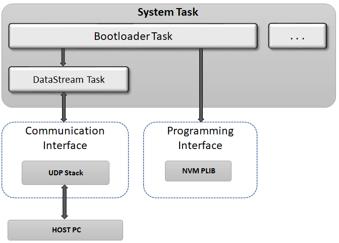

# UDP Bootloader

The UDP bootloader Library can be used to upgrade firmware on a target device without the need for an external programmer or debugger.

**Features**

-   Supported on CORTEX-M and MIPS based MCUs

-   Uses Harmony 3 TCIP Stack to communicate

-   Supports Live update

-   Takes **Normalized Hex File** as input

-   Uses **Unified Host application** to receive the hex file from Host PC

**UDP Bootloader Block Diagram**

**The Bootloader framework is divided into 2 sub-systems**

-   **Bootloader Task:**

    -   Erases the Flash memory

    -   Programs the hex file records into Flash memory

    -   Computes a CRC check of the Application in Program Memory

    -   Jumps to the Application

    -   Calls the DataStream Task at end of its every state machine execution

    -   This Task routine takes an interface-agnostic approach to the actual communication medium

    -   **Runs in Cooperative mode with other tasks in the system**

-   **Datastream Task:**

    -   This Task implements the UDP communication interface to the receive the hex file from the **Unified Host Application** running on Host PC

    -   This Task is called from Bootloader Task routine

-   **[How the UDP Bootloader library works](GUID-E5F8EA96-492F-42CA-8D42-746D091955AD.md)**  

-   **[Bootloader system level execution flow](GUID-B1F2D637-5936-4FD2-BA57-9AEABCB58A3A.md)**  

-   **[UDP Bootloader Configurations](GUID-287956CB-1611-412A-955C-6B85F8BA3916.md)**  

-   **[Configurations for the application to be bootloaded](GUID-81FF31CA-1770-4876-8AAB-FA0015038359.md)**  

-   **[UDP Bootloader Library Interface](GUID-1A9282A3-358C-4218-9A8A-CE8492B06164.md)**  

-   **[UDP Bootloader Unified Host Script Help](GUID-B4EA3FC1-6EDC-409B-B973-1E2B5B9DA982.md)**  

-   **[Debugging Bootloader and Application to be bootloaded](GUID-05CA35ED-C84A-4F88-AAC1-F37D8F6EFEF4.md)**  

**Parent topic:**[MPLAB® Harmony Bootloader Library](GUID-21B27208-104A-468D-8F94-F58D432AB08C.md)

