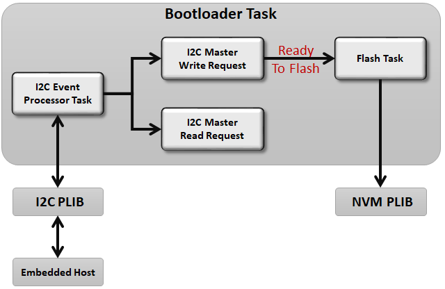

# I2C Bootloader

The I2C bootloader Library can be used to upgrade firmware on a target device without the need for an external programmer or debugger.

**Features**

-   Supported Only on CortexM0+ and CortexM4 based Devices

-   Uses Harmony 3 I2C PLIB to communicate resulting in **smaller bootloader size**

-   Supports Fail Safe update

-   Takes **Binary File** as input

-   Receives Binary from an **I2C Embedded Host Device**

**Running From SRAM \(For SAM Devices\)**

-   Has capability to self update as it is running from SRAM

-   At reset the bootloader Reset handler copies the entire bootloader firmware into SRAM from Start location and start executing from SRAM

-   Once the application is called from bootloader, applications startup code takes control over SRAM and starts executing

**I2C Bootloader Block Diagram**

-   **I2C Event Processor Task:**

    -   This task is responsible for receiving data from Embedded Host through the I2C communication interface

    -   The task polls and processes the I2C events.

    -   Based on the event received it gives control to **I2C Master Write Request** or **I2C Master Read Request** functions

    -   This task is responsible for responding to the bootloader commands received

-   **I2C Master Write Request:**

    -   This function is responsible to handle any write requests coming from I2C master

    -   It processes the commands received and notifies the status to **I2C Event Process Task**

    -   If the command received is a Erase/Prgram/Verify command it gives control to the **Flash task**

-   **I2C Master Read Request:**

    -   This function is responsible to handle any read requests coming from I2C master

    -   It sends the current status to I2C master if the command received is **Read Status**

-   **Flash Task:**

    -   This task is responsible to Erase/Prgram/Verify the internal flash memory with data packet received

    -   The task uses the NVM peripheral library to perform the Unlock/Erase/Write Operations

-   **[How the I2C Bootloader library works](GUID-EFEE222D-BE1D-42F5-A032-C966B5DA09C2.md)**  

-   **[I2C Bootloader system level execution flow](GUID-0F69B7CD-9FC1-43EC-BFBB-B52B8FBAFE9E.md)**  

-   **[I2C Bootloader Configurations](GUID-B9D22739-DB16-4626-A5E8-05C5DCB1C8DD.md)**  

-   **[Configurations for the application to be bootloaded](GUID-81FF31CA-1770-4876-8AAB-FA0015038359.md)**  

-   **[I2C Bootloader Library Interface](GUID-DC31D773-75F7-482A-91FF-204681625DA3.md)**  

-   **[I2C/CAN Bootloader Tools Help](GUID-FCD04D38-6A0B-4B16-ABC6-33AC5EE0C561.md)**  

-   **[Debugging Bootloader and Application to be bootloaded](GUID-05CA35ED-C84A-4F88-AAC1-F37D8F6EFEF4.md)**  

**Parent topic:**[MPLAB® Harmony Bootloader Library](GUID-21B27208-104A-468D-8F94-F58D432AB08C.md)

