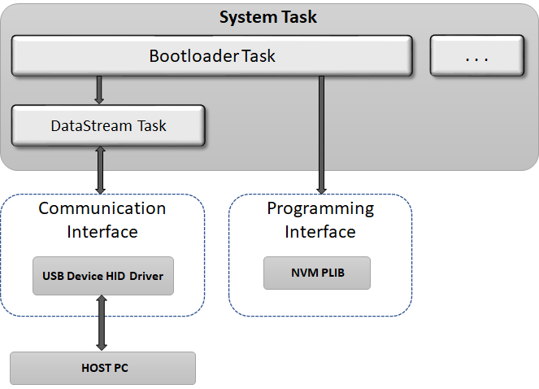

# USB Device HID Bootloader

The USB Device HID bootloader Library can be used to upgrade firmware on a target device without the need for an external programmer or debugger.

**Features**

-   Supported on CORTEX-M and MIPS based MCUs

-   Uses Harmony 3 USB Device HID driver to communicate

-   Supports Live update

-   Takes **Normalized Hex File** as input

-   Uses **Unified Host application** to receive the hex file from Host PC

**USB Device HID Bootloader Block Diagram**

**The Bootloader framework is divided into 2 sub-systems**

-   **Bootloader Task:**

    -   Erases the Flash memory

    -   Programs the hex file records into Flash memory

    -   Computes a CRC check of the Application in Program Memory

    -   Jumps to the Application

    -   Calls the DataStream Task at end of its every state machine execution

    -   This Task routine takes an interface-agnostic approach to the actual communication medium

    -   **Runs in Cooperative mode with other tasks in the system**

-   **Datastream Task:**

    -   This Task implements the USB Device HID communication interface to the receive the hex file from the **Unified Host Application** running on Host PC

    -   This Task is called from Bootloader Task routine

-   **[How the USB Device HID Bootloader library works](GUID-BFB2EC03-1B79-42F8-A77F-26CCCEA0312C.md)**  

-   **[Bootloader system level execution flow](GUID-B1F2D637-5936-4FD2-BA57-9AEABCB58A3A.md)**  

-   **[USB Device HID Bootloader Configurations](GUID-C9AE7919-7F70-4915-B12C-72F6F449C1D2.md)**  

-   **[Configurations for the application to be bootloaded](GUID-81FF31CA-1770-4876-8AAB-FA0015038359.md)**  

-   **[USB Device HID Bootloader Library Interface](GUID-B0B0B2AC-6B17-43C1-B801-46E9639B3E66.md)**  

-   **[USB Device HID Bootloader Unified Host Script Help](GUID-8D4C947B-BA9B-4C1B-AF7A-209A4FC78662.md)**  

-   **[Debugging Bootloader and Application to be bootloaded](GUID-E3F876E5-BE9E-426E-8DC4-E03EF71E8605.md)**  

**Parent topic:**[MPLAB® Harmony Bootloader Library](GUID-21B27208-104A-468D-8F94-F58D432AB08C.md)

