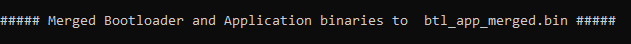

# Bootloader and Application binary merge script Help

**Downloading the host script**

To clone or download these host tools from Github,go to the [main page of this repository](https://github.com/Microchip-MPLAB-Harmony/bootloader) and then click Clone button to clone this repo or download as zip file. This content can also be download using MCC content manager

Path of the tool within the repository is **tools/btl\_app\_merge\_bin.py**

**Setting up the Host PC**

-   The Script is compatible with **Python 3.x** and higher


**Description**

-   This script should be used to merge the bootloader binary and application binary

-   It creates a merged binary output where bootloader is placed from start and the application will be placed at the offset passed as parameter

-   If the application offset is not equal to end of bootloader offset it fills the gap with 0xFF until the application offset

-   The merged binary can be used by **btl\_host.py** as input for Updating bootloader and application together

-   The merged binary will be created in the directory from where the script was called


**Usage Examples**

Below is the syntax to show help menu for the script

```
python <harmony3_path>/bootloader/tools/btl_app_merge_bin.py --help
```


Below is the syntax and an example on how to merge a bootloader binary and application binary

```
python <harmony3_path>/bootloader/tools/btl_app_merge_bin.py -o <Offset> -b <Bootloader_binary_path> -a <Application_binary_path>
```

```c
python <harmony3_path>/bootloader/tools/btl_app_merge_bin.py -o 0x2000 -b <harmony3_path>/bootloader_apps_uart/apps/uart_fail_safe_bootloader/bootloader/firmware/sam_e54_xpro.X/dist/sam_e54_xpro/production/sam_e54_xpro.X.production.bin -a <harmony3_path>/bootloader_apps_uart/apps/uart_fail_safe_bootloader/test_app/firmware/sam_e54_xpro.X/dist/sam_e54_xpro/production/sam_e54_xpro.X.production.bin
```



```c
python <harmony3_path>/bootloader/tools/btl_host.py -v -s -i COM18 -d same5x -a 0x80000 -f <Path_to_merged_binary>/btl_app_merged.bin
```


**Parent topic:**[UART Bootloader Host Script Help](GUID-8BE0388C-8563-4ED8-9C17-F3FE7B88FE51.md)

**Parent topic:**[I2C/CAN Bootloader Tools Help](GUID-FCD04D38-6A0B-4B16-ABC6-33AC5EE0C561.md)

