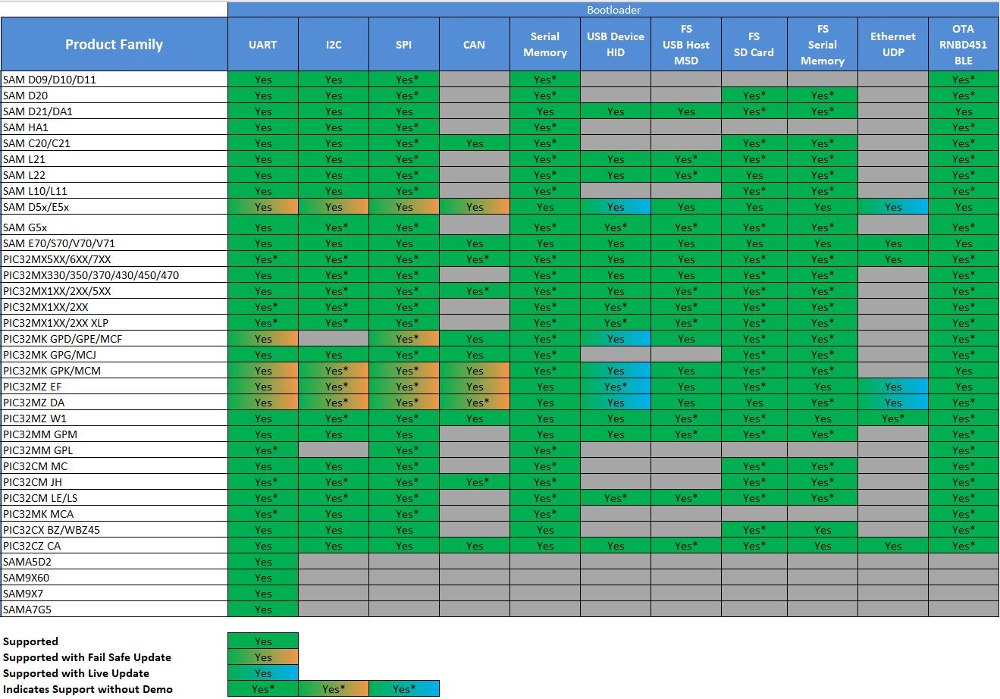

# Microchip MPLAB® Harmony 3 Release Notes

## Bootloader Release v3.6.0

### New Features

- This release includes support for
    - **I2C bootloader** for PIC32M family of 32-bit microcontrollers.
    - **SPI bootloader** for SAM and PIC32M family of 32-bit microcontrollers.            
    - **PIC32CM LE/LS family** of 32-bit microcontrollers       
    - **PIC32CM JH00/01 family** of 32-bit microcontrollers
    - **PIC32MK MCA family** of 32-bit microcontrollers
    - **PIC32MM family** of 32-bit microcontrollers

- Below are new bootloader application repos added
    - [bootloader_apps_spi](https://github.com/Microchip-MPLAB-Harmony/bootloader_apps_spi)
    - Factory programmed bootloader for SAM D20 WLCSP parts is now moved to the [bootloader_apps_sam_d20](https://github.com/Microchip-MPLAB-Harmony/bootloader_apps_sam_d20) repository.

### Bootloaders Supported on different product families
- The following table provides supported bootloaders for different product families
    

        
    

### Known Issues

The current known issues are as follows:

- Initialized global variables will not be initialized at startup for UART, I2C and CAN bootloaders.

- Unified Host application when configured to use USB protocol has to be closed before programming any PIC32M based application using MPLAB X IDE

### Development Tools

* [MPLAB® X IDE v6.05](https://www.microchip.com/mplab/mplab-x-ide)
* [MPLAB® XC32 C/C++ Compiler v4.20](https://www.microchip.com/mplab/compilers)
* MPLAB® X IDE plug-ins:
    * MPLAB® Code Configurator (MCC) v5.1.17

## Bootloader Release v3.5.1

- Updated Bootloader documentation to new format.

### Known Issues
- No changes from v3.5.0

### Development Tools
- No changes from v3.5.0

## Bootloader Release v3.5.0

### New Features

- This release includes support for
    - **Serial Memory Bootloader** for SAM, PIC32M and PIC32C family of 32-bit microcontrollers.
        - I2C EEPROM
        - SPI EEPROM
        - SPI Flash
        - QSPI Flash

    - **USB Live Update** for SAM and PIC32M family of 32-bit microcontrollers.

    - **Ethernet UDP Live Update** for SAM and PIC32M family of 32-bit microcontrollers.

    - **CAN Bootloader** for SAM family of 32-bit microcontrollers.

    - **PIC32CM MC family** of 32-bit microcontrollers
        - UART Bootloader
        - I2C Bootloader
        - SD Card Bootloader

    - **PIC32MZ W1 family** of 32-bit microcontrollers
        - UART Bootloader Bootloader
        - USB Device HID Bootloader
        - USB Host MSD Bootloader
        - Ethernet UDP Bootloader
        - SD Card Bootloader

- Added new **File System Bootloader** component supporting below medias
    - SD Card
    - USB Host MSD
    - Serial Memory

- Updated default optimization level for all bootloaders to **-O2**

- Added markdown based documentation for Bootloader Library

- Below are new bootloader application repos added
    - [bootloader_apps_can](https://github.com/Microchip-MPLAB-Harmony/bootloader_apps_can)
    - [bootloader_apps_serial_memory](https://github.com/Microchip-MPLAB-Harmony/bootloader_apps_serial_memory)

### Bootloaders Supported on different product families

- The following table provides supported bootloders for different product families

    

        
    

### Known Issues

The current known issues are as follows:

- Any existing **USB Host MSD** bootloader and **SD Card** bootloader projects have to be reconfigured to use the new **File System Bootloader** component in MHC

- Initialized global variables will not be initialized at startup for UART, I2C and CAN bootloaders.

- Unified Host application when configured to use USB protocol has to be closed before programming any PIC32M based application using MPLAB X IDE

### Development Tools

* [MPLAB® X IDE v5.50](https://www.microchip.com/mplab/mplab-x-ide)
* [MPLAB® XC32 C/C++ Compiler v3.00](https://www.microchip.com/mplab/compilers)
* MPLAB® X IDE plug-ins:
    * MPLAB® Harmony 3 Launcher v3.6.4 and above.

## Bootloader Release v3.4.1

- Updated Bootloader component to disable default linker file generation added in csp v3.8.0 as it requires custom linker file

### Known Issues
- No changes from v3.4.0

### Development Tools
- No changes from v3.4.0

## Bootloader Release v3.4.0
### New Features

- This release includes support for
    - USB Device HID Bootloader for SAM and PIC32M family of 32-bit microcontrollers.
    - USB Host MSD Bootloader for SAM and PIC32M family of 32-bit microcontrollers.
    - Ethernet UDP Bootloader for SAM and PIC32M family of 32-bit microcontrollers.
    - SD Card Bootloader for SAM and PIC32M family of 32-bit microcontrollers.

- Bootloader demo application are placed in below repositories
    - [bootloader_apps_uart](https://github.com/Microchip-MPLAB-Harmony/bootloader_apps_uart)
    - [bootloader_apps_i2c](https://github.com/Microchip-MPLAB-Harmony/bootloader_apps_i2c)
    - [bootloader_apps_usb](https://github.com/Microchip-MPLAB-Harmony/bootloader_apps_usb)
    - [bootloader_apps_ethernet](https://github.com/Microchip-MPLAB-Harmony/bootloader_apps_ethernet)
    - [bootloader_apps_sdcard](https://github.com/Microchip-MPLAB-Harmony/bootloader_apps_sdcard)

### Bootloaders Supported on different product families
- The following table provides supported bootloders for different product families

    | Product Family                 | UART   | I2C    | USB Device HID | USB Host MSD | UDP   | SDCARD   | UART Fail Safe | I2C Fail Safe |
    | ------------------------------ | ------ | ------ | -------------- | ------------ | ----- | -------- | -------------- | ------------- |
    | SAM D09/D10/D11                | Yes    | Yes    | No             | No           | NA    | No       | NA             | NA            |
    | SAM D20                        | Yes    | Yes    | NA             | NA           | NA    | Yes      | NA             | NA            |
    | SAM D21/DA1                    | Yes    | Yes    | Yes            | Yes          | NA    | Yes      | NA             | NA            |
    | SAM HA1                        | Yes    | Yes    | NA             | NA           | NA    | No       | NA             | NA            |
    | SAM C20/C21                    | Yes    | Yes    | NA             | NA           | NA    | Yes      | NA             | NA            |
    | SAM L21                        | Yes    | Yes    | Yes            | Yes          | NA    | Yes      | NA             | NA            |
    | SAM L22                        | Yes    | Yes    | Yes            | Yes          | NA    | Yes      | NA             | NA            |
    | SAM L10/L11                    | Yes    | Yes    | NA             | NA           | NA    | Yes      | NA             | NA            |
    | SAM D5x/E5x                    | Yes    | Yes    | Yes            | Yes          | Yes   | Yes      | Yes            | Yes           |
    | SAM G5x                        | Yes    | No     | Yes            | Yes          | NA    | Yes      | NA             | NA            |
    | SAM E70/S70/V70/V71            | Yes    | No     | Yes            | Yes          | Yes   | Yes      | NA             | NA            |
    | PIC32MX5XX/6XX/7XX             | Yes    | No     | Yes            | Yes          | Yes   | Yes      | NA             | NA            |
    | PIC32MX330/350/370/430/450/470 | Yes    | No     | Yes            | Yes          | NA    | Yes      | NA             | NA            |
    | PIC32MX1XX/2XX/5XX             | Yes    | No     | Yes            | Yes          | NA    | Yes      | NA             | NA            |
    | PIC32MX1XX/2XX                 | Yes    | No     | Yes            | Yes          | NA    | Yes      | NA             | NA            |
    | PIC32MX1XX/2XX XLP             | Yes    | No     | Yes            | Yes          | NA    | Yes      | NA             | NA            |
    | PIC32MK GPD/GPE/MCF            | Yes    | NA     | Yes            | Yes          | NA    | Yes      | Yes            | NA            |
    | PIC32MK GPG/MCJ                | Yes    | No     | NA             | NA           | NA    | Yes      | NA             | NA            |
    | PIC32MK GPK/MCM                | Yes    | No     | Yes            | Yes          | NA    | Yes      | Yes            | No            |
    | PIC32MZ EF                     | Yes    | No     | Yes            | Yes          | Yes   | Yes      | Yes            | No            |
    | PIC32MZ DA                     | Yes    | No     | Yes            | Yes          | Yes   | Yes      | Yes            | No            |

### Known Issues

The current known issues are as follows:

* Initialized global variables will not be initialized at startup for UART and I2C bootloaders.

* Unified Host application when configured to use USB protocol has to be closed before programming any PIC32M based application using MPLAB X IDE

### Development Tools

* [MPLAB® X IDE v5.40](https://www.microchip.com/mplab/mplab-x-ide)
* [MPLAB® XC32 C/C++ Compiler v2.41](https://www.microchip.com/mplab/compilers)
* MPLAB® X IDE plug-ins:
    * MPLAB® Harmony Configurator (MHC) v3.5.0 and above.

## Bootloader Release v3.3.0
### New Features

- This Release adds I2C Bootloader WLCSP applications for SAMD20 family of 32-bit microcontrollers

    - The following WLCSP devices are shipped with preprogrammed bootloader

    | Device Part Number     |
    | ---------------------- |
    | SAMD20 (ATSAMD20E15BU) |
    | SAMD20 (ATSAMD20E16BU) |

### Known Issues

- N/A

### Development Tools

* [MPLAB® X IDE v5.40](https://www.microchip.com/mplab/mplab-x-ide)
* [MPLAB® XC32 C/C++ Compiler v2.41](https://www.microchip.com/mplab/compilers)
* MPLAB® X IDE plug-ins:
    * MPLAB® Harmony Configurator (MHC) v3.5.0 and above

## Bootloader Release v3.2.0
### New Features

- **New part support** - This release introduces support of

    UART Bootloader for
    [SAM HA1](https://www.microchip.com/wwwproducts/en/ATSAMHA1G16A-B) family of 32-bit microcontrollers.

    UART Fail Safe Bootloader for
    [PIC32MZ EF](https://www.microchip.com/design-centers/32-bit/pic-32-bit-mcus/pic32mz-ef-family),
    [PIC32MZ DA](https://www.microchip.com/design-centers/32-bit/pic-32-bit-mcus/pic32mz-da-family),
    [PIC32MK](https://www.microchip.com/design-centers/32-bit/pic-32-bit-mcus/pic32mk-family),
    PIC32MK GPK/GPL/MCM family of 32-bit microcontrollers.

    I2C Bootloader for 
    [SAM C20/C21](https://www.microchip.com/design-centers/32-bit/sam-32-bit-mcus/sam-c-mcus),
    [SAM D09/D10/D11](https://www.microchip.com/design-centers/32-bit/sam-32-bit-mcus/sam-d-mcus)
    [SAM D20/D21](https://www.microchip.com/design-centers/32-bit/sam-32-bit-mcus/sam-d-mcus),
    [SAM DA1](https://www.microchip.com/design-centers/32-bit/sam-32-bit-mcus/sam-d-mcus),
    [SAME5x](https://www.microchip.com/design-centers/32-bit/sam-32-bit-mcus/sam-e-mcus),
    [SAMD5x](https://www.microchip.com/design-centers/32-bit/sam-32-bit-mcus/sam-d-mcus),
    [SAML10](https://www.microchip.com/design-centers/32-bit/sam-32-bit-mcus/sam-l-mcus),
    [SAML21](https://www.microchip.com/design-centers/32-bit/sam-32-bit-mcus/sam-l-mcus),
    [SAML22](https://www.microchip.com/design-centers/32-bit/sam-32-bit-mcus/sam-l-mcus) family of 32-bit microcontrollers.

- **Development kit and demo application support** - The following table provides demo application available for different development kits.

    | Development kits | UART Bootloader | I2C Bootloader | UART Fail Safe Bootloader | I2C Fail Safe Bootloader |
    | --- | --- | --- | --- | --- |
    | [PIC32MK GP Development Kit](https://www.microchip.com/developmenttools/ProductDetails/dm320106)                                                  | Yes | No  | Yes | No  |
    | PIC32MK MCJ Curiosity Pro                                                                                                                         | Yes | No  | No  | No  |
    | PIC32MK MCM Curiosity Pro                                                                                                                         | Yes | No  | Yes | No  |
    | [PIC32MX1/2/5 Starter Kit](https://www.microchip.com/developmenttools/productdetails/dm320100)                                                    | Yes | No  | NA  | NA  |
    | [Curiosity PIC32MX470 Development Board](https://www.microchip.com/DevelopmentTools/ProductDetails/dm320103)                                      | Yes | No  | NA  | NA  |
    | [PIC32MZ Embedded Graphics with Stacked DRAM (DA) Starter Kit (Crypto)](https://www.microchip.com/DevelopmentTools/ProductDetails/DM320010-C)     | Yes | No  | Yes | No  |
    | [PIC32MZ Embedded Connectivity with FPU (EF) Starter Kit](https://www.microchip.com/Developmenttools/ProductDetails/Dm320007)                     | Yes | No  | Yes | No  |
    | [SAM C21N Xplained Pro Evaluation Kit](https://www.microchip.com/DevelopmentTools/ProductDetails.aspx?PartNO=ATSAMC21-XPRO)                       | Yes | Yes | NA  | NA  |
    | [SAM D11 Xplained Pro Evaluation Kit](https://www.microchip.com/developmenttools/ProductDetails/atsamd11-xpro)                                    | Yes | Yes | NA  | NA  |
    | [SAM D20 Xplained Pro Evaluation Kit](https://www.microchip.com/DevelopmentTools/ProductDetails.aspx?PartNO=ATSAMD20-XPRO)                        | Yes | Yes | NA  | NA  |
    | [SAM D21 Xplained Pro Evaluation Kit](https://www.microchip.com/DevelopmentTools/ProductDetails.aspx?PartNO=ATSAMD21-XPRO)                        | Yes | Yes | NA  | NA  |
    | [SAM DA1 Xplained Pro Evaluation Kit](https://www.microchip.com/DevelopmentTools/ProductDetails/PartNO/ATSAMDA1-XPRO)                             | Yes | Yes | NA  | NA  |
    | [SAM E54 Xplained Pro Evaluation Kit](https://www.microchip.com/developmenttools/ProductDetails/ATSAME54-XPRO)                                    | Yes | Yes | Yes | Yes |
    | [SAM E70 Xplained Ultra Evaluation Kit](https://www.microchip.com/DevelopmentTools/ProductDetails.aspx?PartNO=ATSAME70-XULT)                      | Yes | No  | NA  | NA  |
    | [SAM G55 Xplained Pro Evaluation Kit](https://www.microchip.com/developmenttools/ProductDetails/atsamg55-xpro)                                    | Yes | No  | NA  | NA  |
    | [SAM L10 Xplained Pro Evaluation Kit](https://www.microchip.com/DevelopmentTools/ProductDetails/dm320204)                                         | Yes | Yes | NA  | NA  |
    | [SAM L21 Xplained Pro Evaluation Kit](https://www.microchip.com/developmenttools/ProductDetails/ATSAML21-XPRO-B)                                  | Yes | Yes | NA  | NA  |
    | [SAM L22 Xplained Pro Evaluation Kit](https://www.microchip.com/developmenttools/ProductDetails/ATSAML22-XPRO-B)                                  | Yes | Yes | NA  | NA  |

### Known Issues

The current known issues are as follows:

* Use MPLAB X IDE V5.25 with SAM DA1 Xplained Pro.

* SAM HA1 will be supported in the next version of MPLAB X IDE release.

* The I2C bootloader for SAM E54 may not work with clock stretching for bootloader commands disabled.

### Development Tools

* [MPLAB® X IDE v5.30](https://www.microchip.com/mplab/mplab-x-ide)
* [MPLAB® XC32 C/C++ Compiler v2.30](https://www.microchip.com/mplab/compilers)
* MPLAB® X IDE plug-ins:
    * MPLAB® Harmony Configurator (MHC) v3.3.5 and above.

## Bootloader Release v3.1.2
### New Features

- **New part support** - This release introduces initial support of UART bootloader for [SAM DA1](https://www.microchip.com/design-centers/32-bit/sam-32-bit-mcus/sam-d-mcus), [SAM D09/D10/D11](https://www.microchip.com/design-centers/32-bit/sam-32-bit-mcus/sam-d-mcus), [PIC32MX 1XX/2XX](https://www.microchip.com/design-centers/32-bit/pic-32-bit-mcus/pic32mx-family), [PIC32MX 1XX/2XX XLP](https://www.microchip.com/design-centers/32-bit/pic-32-bit-mcus/pic32mx-family), [PIC32MX 1XX/2XX/5XX](https://www.microchip.com/design-centers/32-bit/pic-32-bit-mcus/pic32mx-family), [PIC32MX 3XX/4XX](https://www.microchip.com/design-centers/32-bit/pic-32-bit-mcus/pic32mx-family), [PIC32MX5XX/6XX/7XX](https://www.microchip.com/design-centers/32-bit/pic-32-bit-mcus/pic32mx-family), [PIC32MZ EF](https://www.microchip.com/design-centers/32-bit/pic-32-bit-mcus/pic32mz-ef-family), [PIC32MZ DA](https://www.microchip.com/design-centers/32-bit/pic-32-bit-mcus/pic32mz-da-family), [PIC32MK](https://www.microchip.com/design-centers/32-bit/pic-32-bit-mcus/pic32mk-family), PIC32MK GPH/GPG/MCJ, PIC32MK GPK/GPL/MCM, family of 32-bit microcontrollers.

- **Development kit and demo application support** - The following table provides number of demo application available for different development kits newly added in this release.

    | Development kits | Bootloader applications |
    | --- | --- |
    | PIC32MK GPL Curiosity Pro | 2 |
    | PIC32MK MCJ Curiosity Pro | 2 |
    | [PIC32MX1/2/5 Starter Kit](https://www.microchip.com/developmenttools/productdetails/dm320100) | 2 |
    | [Curiosity PIC32MX470 Development Board](https://www.microchip.com/DevelopmentTools/ProductDetails/dm320103) | 2 |
    | [PIC32MZ Embedded Graphics with Stacked DRAM (DA) Starter Kit (Crypto)](https://www.microchip.com/DevelopmentTools/ProductDetails/DM320010-C) | 2 |
    | [PIC32MZ Embedded Connectivity with FPU (EF) Starter Kit](https://www.microchip.com/Developmenttools/ProductDetails/Dm320007) | 2 |
    | [SAM C21N Xplained Pro Evaluation Kit](https://www.microchip.com/DevelopmentTools/ProductDetails.aspx?PartNO=ATSAMC21-XPRO) | 2 |
    | [SAM D11 Xplained Pro Evaluation Kit](https://www.microchip.com/developmenttools/ProductDetails/atsamd11-xpro) | 2 |
    | [SAM D20 Xplained Pro Evaluation Kit](https://www.microchip.com/DevelopmentTools/ProductDetails.aspx?PartNO=ATSAMD20-XPRO) | 2 |
    | [SAM D21 Xplained Pro Evaluation Kit](https://www.microchip.com/DevelopmentTools/ProductDetails.aspx?PartNO=ATSAMD21-XPRO) | 2 |
    | [SAM DA1 Xplained Pro Evaluation Kit](https://www.microchip.com/DevelopmentTools/ProductDetails/PartNO/ATSAMDA1-XPRO) | 2 |
    | [SAM E54 Xplained Pro Evaluation Kit](https://www.microchip.com/developmenttools/ProductDetails/ATSAME54-XPRO) | 4 |
    | [SAM E70 Xplained Ultra Evaluation Kit](https://www.microchip.com/DevelopmentTools/ProductDetails.aspx?PartNO=ATSAME70-XULT) | 2 |
    | [SAM G55 Xplained Pro Evaluation Kit](https://www.microchip.com/developmenttools/ProductDetails/atsamg55-xpro) | 2 |
    | [SAM L10 Xplained Pro Evaluation Kit](https://www.microchip.com/DevelopmentTools/ProductDetails/dm320204) | 2 |
    | [SAM L21 Xplained Pro Evaluation Kit](https://www.microchip.com/developmenttools/ProductDetails/ATSAML21-XPRO-B) | 2 |
    | [SAM L22 Xplained Pro Evaluation Kit](https://www.microchip.com/developmenttools/ProductDetails/ATSAML22-XPRO-B) | 2 |

- Updated the Bootloader host scripts in bootloader/tools to be compatible with Python 3.x

- Moved the Bootloader host scripts compatible with Python 2.7.x to bootloader/tools_archive folder. These scripts may be removed in future.

### Known Issues

The current known issues are as follows:

* Configuration fuse macros are not generated for SAM D09/D10/D11 devices. 

* PIC32MK GPK/GPL/MCM will be supported in the next version of MPLAB X IDE release.

* SAME70 Bootloader application may not work on lower system frequency with high UART Baud-Rate.

* Interactive help using the Show User Manual Entry in the Right-click menu for configuration options provided by this module is not yet available from within the MPLAB Harmony Configurator (MHC).
  Please see the *Configuring the Library* section in the help documentation in the doc folder for this Harmony 3 module instead. Help is available in CHM format.

### Development Tools

* [MPLAB® X IDE v5.25](https://www.microchip.com/mplab/mplab-x-ide)
* [MPLAB® XC32 C/C++ Compiler v2.30](https://www.microchip.com/mplab/compilers)
* MPLAB® X IDE plug-ins:
* MPLAB® Harmony Configurator (MHC) v3.3.0.1 and above.

## Bootloader Release v3.1.1

* Added MPLAB® Harmony License File

## Bootloader Release v3.1.0
### New Features

- **New part support** - This release introduces initial support of UART bootloader for [SAML10](https://www.microchip.com/design-centers/32-bit/sam-32-bit-mcus/sam-l-mcus)
and [SAMG55](https://www.microchip.com/design-centers/32-bit/sam-32-bit-mcus/sam-g-mcus) family of 32-bit microcontrollers.

- **Development kit and demo application support** - The following table provides number of demo application available for different development kits newly added in this release.

    | Development kits | Bootloader applications |
    | --- | --- |
    | [SAM C21N Xplained Pro Evaluation Kit](https://www.microchip.com/DevelopmentTools/ProductDetails.aspx?PartNO=ATSAMC21-XPRO) | 2 |
    | [SAM D20 Xplained Pro Evaluation Kit](https://www.microchip.com/DevelopmentTools/ProductDetails.aspx?PartNO=ATSAMD20-XPRO) | 2 |
    | [SAM D21 Xplained Pro Evaluation Kit](https://www.microchip.com/DevelopmentTools/ProductDetails.aspx?PartNO=ATSAMD21-XPRO) | 2 |
    | [SAM E54 Xplained Pro Evaluation Kit](https://www.microchip.com/developmenttools/ProductDetails/ATSAME54-XPRO) | 4 |
    | [SAM E70 Xplained Ultra Evaluation Kit](https://www.microchip.com/DevelopmentTools/ProductDetails.aspx?PartNO=ATSAME70-XULT) | 2 |
    | [SAM G55 Xplained Pro Evaluation Kit](https://www.microchip.com/developmenttools/ProductDetails/atsamg55-xpro) | 2 |
    | [SAM L10 Xplained Pro Evaluation Kit](https://www.microchip.com/DevelopmentTools/ProductDetails/dm320204) | 2 |
    | [SAM L21 Xplained Pro Evaluation Kit](https://www.microchip.com/developmenttools/ProductDetails/ATSAML21-XPRO-B) | 2 |
    | [SAM L22 Xplained Pro Evaluation Kit](https://www.microchip.com/developmenttools/ProductDetails/ATSAML22-XPRO-B) | 2 |

### Known Issues

The current known issues are as follows:

- SAME70 Bootloader application may not work on lower system frequency with high UART Baud-Rate.

### Development Tools

* [MPLAB® X IDE v5.20](https://www.microchip.com/mplab/mplab-x-ide)
* [MPLAB® XC32 C/C++ Compiler v2.20](https://www.microchip.com/mplab/compilers)
* MPLAB® X IDE plug-ins:
  * MPLAB® Harmony Configurator (MHC) v3.3.0.1 and above.

## Bootloader Release v3.0.0
### New Features

- **New part support** - This release introduces initial support for [SAM C20/C21](https://www.microchip.com/design-centers/32-bit/sam-32-bit-mcus/sam-c-mcus), [SAM D20/D21](https://www.microchip.com/design-centers/32-bit/sam-32-bit-mcus/sam-d-mcus), [SAM S70](https://www.microchip.com/design-centers/32-bit/sam-32-bit-mcus/sam-s-mcus), [SAM E70](https://www.microchip.com/design-centers/32-bit/sam-32-bit-mcus/sam-e-mcus), [SAM V70/V71](https://www.microchip.com/design-centers/32-bit/sam-32-bit-mcus/sam-v-mcus), [SAME5x](https://www.microchip.com/design-centers/32-bit/sam-32-bit-mcus/sam-e-mcus), [SAMD5x](https://www.microchip.com/design-centers/32-bit/sam-32-bit-mcus/sam-d-mcus), [SAML21](https://www.microchip.com/design-centers/32-bit/sam-32-bit-mcus/sam-l-mcus), [SAML22](https://www.microchip.com/design-centers/32-bit/sam-32-bit-mcus/sam-l-mcus) family of 32-bit microcontrollers.

- Added support for UART bootloader.

- **Development kit and demo application support** - The following table provides number of demo application available for different development kits newly added in this release.

    | Development kits | Bootloader applications |
    | --- | --- |
    | [SAM C21N Xplained Pro Evaluation Kit](https://www.microchip.com/DevelopmentTools/ProductDetails.aspx?PartNO=ATSAMC21-XPRO) | 2 |
    | [SAM D20 Xplained Pro Evaluation Kit](https://www.microchip.com/DevelopmentTools/ProductDetails.aspx?PartNO=ATSAMD20-XPRO) | 2 |
    | [SAM D21 Xplained Pro Evaluation Kit](https://www.microchip.com/DevelopmentTools/ProductDetails.aspx?PartNO=ATSAMD21-XPRO) | 2 |
    | [SAM E54 Xplained Pro Evaluation Kit](https://www.microchip.com/developmenttools/ProductDetails/ATSAME54-XPRO) | 4 |
    | [SAM E70 Xplained Ultra Evaluation Kit](https://www.microchip.com/DevelopmentTools/ProductDetails.aspx?PartNO=ATSAME70-XULT) | 2 |
    | [SAM L21 Xplained Pro Evaluation Kit](https://www.microchip.com/developmenttools/ProductDetails/ATSAML21-XPRO-B) | 2 |
    | [SAM L22 Xplained Pro Evaluation Kit](https://www.microchip.com/developmenttools/ProductDetails/ATSAML22-XPRO-B) | 2 |

### Known Issues

The current known issues are as follows:

- SAME70 Bootloader application may not work on lower system frequency with high UART Baud-Rate.

### Development Tools

* [MPLAB® X IDE v5.20](https://www.microchip.com/mplab/mplab-x-ide)
* [MPLAB® XC32 C/C++ Compiler v2.20](https://www.microchip.com/mplab/compilers)
* MPLAB® X IDE plug-ins:
  * MPLAB® Harmony Configurator (MHC) v3.3.0.1 and above.
