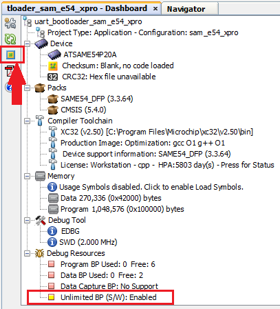
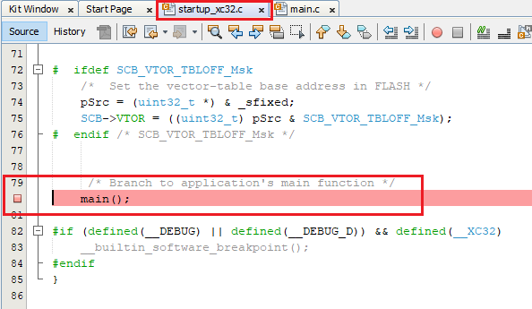

# Debugging UART, I2C and CAN Bootloaders for CORTEX-M based MCUs

The UART, I2C and CAN bootloaders for CORTEX-M based MCU's are designed to run from SRAM to support
- Simultaneous Flash memory write and reception of the next block of data

- Self update

    

        
    

- **For debugging these bootloaders make use of software breakpoints instead of Hardware breakpoints**

## Steps to enable software breakpoints and start debugging

1. Enable software breakpoint from the project configuration dashboard by clicking on the button as shown below

    

        
    

2. **Software breakpoints inside main() when running from SRAM do not work when set before starting the debugger.**
    - For them to work first set a Breakpoint in **startup_xc32.c** file as it is running from flash

    

        
    

3. Start the debugger from MPLAB IDE and the **software break point** in startup file will be hit

    

        
    

4. Once the breakpoint is hit in startup file, then set breakpoints anywhere you want, like in **main()** function as shown below

    

        
    

5. Resume the debugger and you should be able to now debug as usual

    

        
    

## Additional Information

- Refer to [Debugging Bootloader And Application](../../docs/debugging_bootloader_and_application.md) for debugging the application to be bootloaded along with bootloader
