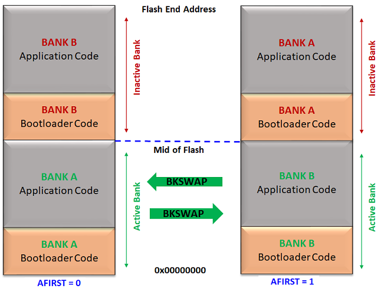

# Fail Safe Update Memory layout for CORTEX-M based MCUs

- Supported for the devices which have a Dual Bank flash memory

- Internal Flash memory is split into two equal banks. Special NVM Fuse setting **(AFIRST)** is used to identify which bank is mapped to NVM main address space after reset.

    - Start address of **Active Bank** is always **start of Internal Flash memory**

    - Start address of **Inactive Bank** is from mid of the Internal flash memory which can vary from device to device. Refer to respective Data sheets for details of Flash memory layout.

- **Bootloader must be placed at start location of both banks**

- The application code can be placed anywhere **after the bootloader end address** till **mid of flash**. The application start address should be **aligned to Erase Unit Size of the device**

- As the Bootloader code requires the application start address to be mentioned at compile time, it should match in both the application and bootloader

- Bootloader running from Active bank will program the new image in inactive bank

- Bootloader is responsible to perform a bank swap and reset to run the new firmware programmed in Inactive bank

    

        
    

## Additional Information

- Refer to [Configurations for CORTEX-M based MCUs](./arm_configurations.md) for more information on Bootloader linker and application configurations
