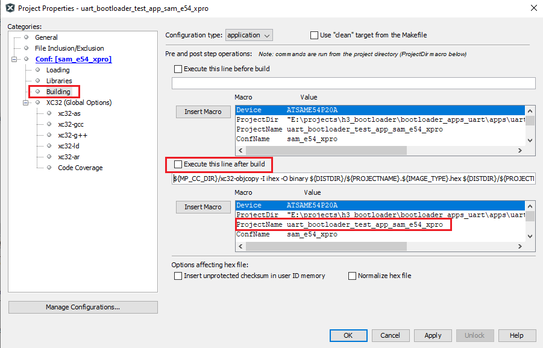
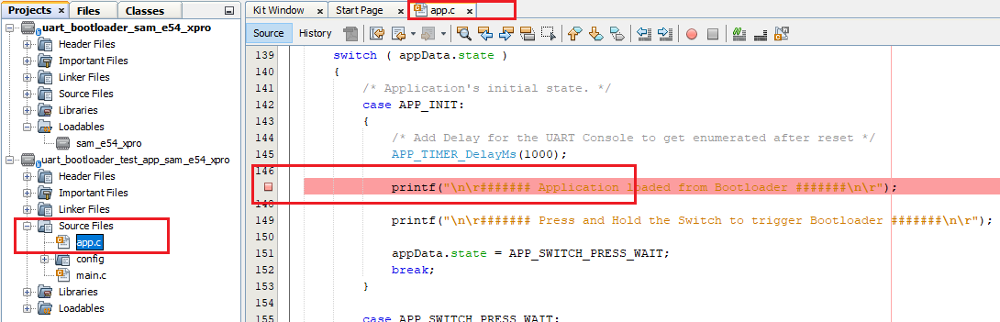
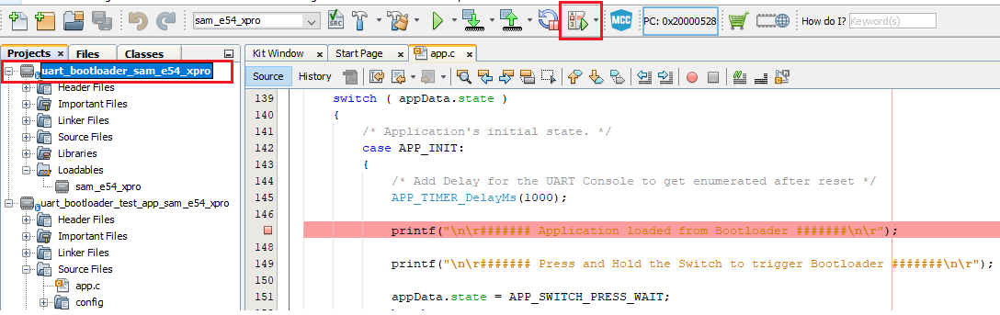

[](https://www.microchip.com)

# Debugging Bootloader and Application to be bootloaded

1. Open the bootloader project to be debugged in the MPLAB IDE

2. Make sure that the **application to be bootloaded** and debugged is added as a loadable project to bootloader project
    - Adding the **application as loadable** allows MPLAB X to create a **unified hex file** and program both bootloader and application in thier respective memory locations
        - Bootloader in bootloader space
        - Application in application space

    <p align="center">
        
    </p>

3. Open the **application project** in the IDE and disable post build script exection if any as shown below
    - Having this binary conversion post build script enabled will result in build error during debugging as there will be no hex file generated

    <p align="center">
        
    </p>

4. Set breakpoint as required in application project. Below is a an example snapshot
    - If the bootloader also has to be debugged and if it is any of UART, I2C and CAN bootloader for CORTEX-M based MCUs refer to steps in [Debugging Bootloaders For CORTEX-M based MCUs](../arm/docs/arm_bootloader_debugging.md) to set software breakpoints

    <p align="center">
        
    </p>

5. Start debugger for the **bootloader** project using the IDE. This should program both bootloader and application

    <p align="center">
        
    </p>

6. Once the debugger is started the bootloader first runs and then jumps to application code. You should see the application breakpoint hit if application code is running

    <p align="center">
        
    </p>

## Additional Information (For MIPS based MCUs)

- When combining the Bootloader and Application Hex files in MPLAB X IDE, an error may be generated if the device Configuration words are different. This will be shown as a data conflict error, and the address given will match an address in the device Configuration words.

- This can be resolved by discarding the **Device Configuration settings** from application linker file as shown below

```c
/DISCARD/ : { *(.config_*) }
```

- Refer to [Application Linker Script Configurations](../mips/docs/mips_application_linker_config.md) for information on how to setup a linker script for the application to be bootloaded for MIPS based MCus
