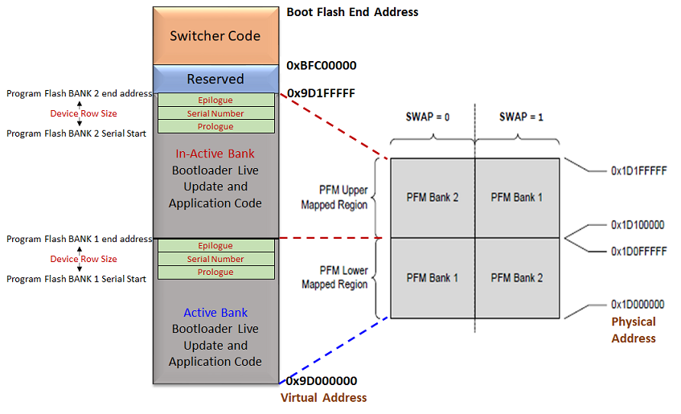

# Live Update Memory layout for MIPS based MCUs

- Supported for the devices which have a Dual Bank flash memory

- **Switcher code** is placed at start of the Boot flash memory (0xBFC00000) as upon reset the device runs from start of boot flash memory.
    - **Note: The switcher code provided does not have any programming capabilities.It just performs bank swap operations**

- Device always executes the application firmware from PFM bank mapped to lower memory region **(0x1D00_0000 Physical address)**
    - Start address of Active Bank is mapped to lower region **0x9D000000**

    - Start address of Inactive Bank is from mid of the PFM which can vary from device to device. Refer to respective Data sheets for details of Flash memory layout.

- Row size number of bytes are reserved at end of each bank for storing serial number. This serial number will be used by the **switcher code placed in BFM** to map the appropriate PFM bank to lower memory region and run the application from there

- **Volatile register SWAP bit** is used to map either of bank to lower memory region by switcher

- The bootloader live update code responsible to program the inactive bank is part of the application it self. Which means the programming operation can happen while the application is running
    - **Live Update Application = (Bootloader Code in Live Update mode + Application code)**

- The application code is responsible to send a request to bootloader live update code to perform a **bank swap and reset** to run the new firmware programmed in Inactive bank

- Once this request is received the bootloader live update code performs below operation before initiating a reset to run new firmware
    - **Inactive Serial number = Active serial number + 1**

- At reset switcher first maps Bank 1 to lower region and reads the serial numbers from both banks

- If Bank 2 serial number is greater than Bank 1 serial number, it maps Bank 2 to lower region by setting the Swap bit and runs the new firmware. **Now Bank 2 is Active bank**

- The live update start address should always fall into lower mapped region **(0x9D000000 to Mid of Flash)**. Size of the application in the linker script should also not exceed the Mid of flash.

    

        
    

## Additional Information

- Refer to [Configurations for MIPS based MCUs](./mips_configurations.md) for more information on bootloader linker and application linker configurations
