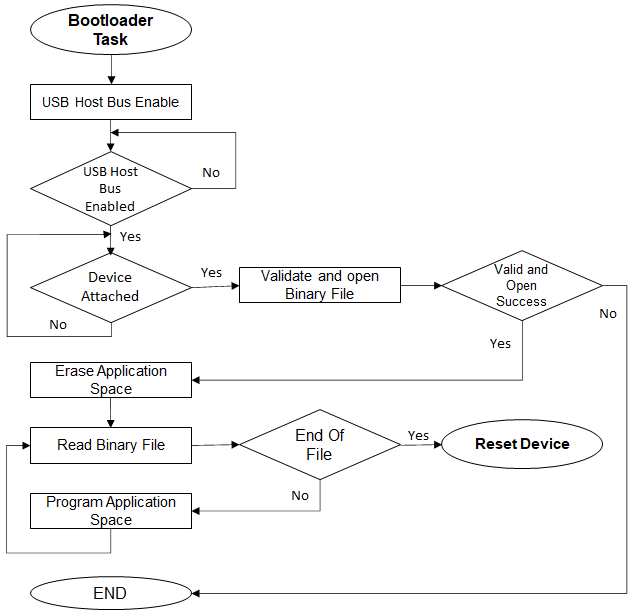

# File System Bootloader Firmware Update mode execution flow

## Bootloader Task Flow

- Erases the Flash memory 

- Programs the binary into Flash memory 

- Jumps to the Application 

### USB Host MSD Bootloader Task Flow

    

### SD Card and Serial Memory Bootloader Task Flow

    

