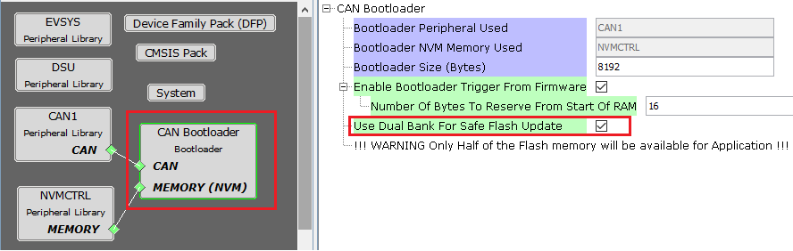
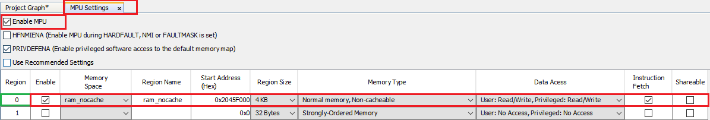
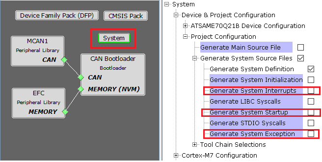

[](https://www.microchip.com)

# CAN Bootloader Configurations

## Bootloader Specific User Configurations

### For devices with Dual Bank support and No Data Cache

<p align="center">
    
</p>

### For devices with No Dual Bank support and Data Cache

<p align="center">
    
</p>

- **Bootloader Peripheral Used:**
    - Specifies the communication peripheral used by bootloader to receive the application
    - The name of the peripheral will vary from device to device

- **Bootloader NVM Memory Used:**
    - Specifies the memory peripheral used by bootloader to perform flash operations
    - The name of the peripheral will vary from device to device

- **Bootloader Size (Bytes):**
    - Specifies the maximum size of flash required by the bootloader
    - This size is calculated based on Bootloader type and Memory used
    - This size will vary from device to device and should always be aligned to device erase unit size

- **Enable Bootloader Trigger From Firmware:**
    - This Option can be used to Force Trigger bootloader from application firmware after a soft reset. It does so by reserving the specified number of bytes in SRAM from the start of the RAM. The reserved memory is updated by the application with a pre-defined pattern. The bootloader firmware in the [bootloader_Trigger()](./can_bootloader_library_interface.md#bootloader_trigger) routine, can check the reserved memory for the pre-defined pattern and enter bootloader mode if the pattern matches.

    - **Number Of Bytes To Reserve From Start Of RAM:**
        - This option adds the provided offset to RAM Start address in bootloader linker script.
        - Application firmware can store some pattern in the reserved bytes region from RAM start for bootloader to check at reset in [bootloader_Trigger()](./can_bootloader_library_interface.md#bootloader_trigger) function

- **Use Dual Bank For Safe Flash Update:**
    - Used to configure bootloader to use Dual banks of device to upload the application
    - This option is visible only for devices supporting Dual flash banks

- **Select MPU Region to configure non-cacheable memory:**
    - Used to select the MPU region for which he SRAM has been configured as non-cahceable space

    - Configure the region selected above in MPU settings of MHC as shown in [Bootloader MPU Configurations](#bootloader-mpu-configurations)

    - A seperate section will be created for this region in the custom linker script generated for bootloader

    - This option is visible only for devices which have Data cache.

## Bootloader MPU Configurations

- Open MPU settings from MHC->Tools option. Select **Enable MPU**

- Configure the region selected in Bootloader component as **ram_nocache** with other parameters as shown

    <p align="center">
        
    </p>

### Bootloader Linker code for ram_nochache

- For CAN bootloader below **xxx_message_ram** section will be added to the custom linker file generated
    - **Note: xxx should be replaced with the CAN PLIB being used.**
    - Example: **MCAN1**

```c
MEMORY
{
  rom (rx) : ORIGIN = ROM_START, LENGTH = ROM_SIZE
  ram (rwx) : ORIGIN = RAM_START, LENGTH = RAM_SIZE

  /* The address mentioned here should match with address mentioned in MPU settings */
  ram_nocache (RWX) : ORIGIN = 0x2045f000, LENGTH = (1 << (11 + 1))

}

...
...

.mcan1_message_ram (NOLOAD):
{
    . = ALIGN(4);
    _s_mcan1_message_ram = .;
    *(.mcan1_message_ram)
    . = ALIGN(4);
    _e_mcan1_message_ram = .;
} > ram_nocache

...

```

- CAN Bootloader will use this section to to allocate **MCAN Message RAM configuration in contiguous non-cacheable buffer**

```c
static uint8_t CACHE_ALIGN __attribute__((space(data), section (".mcan1_message_ram"))) mcan1MessageRAM[MCAN1_MESSAGE_RAM_CONFIG_SIZE];

/* Set MCAN1 Message RAM Configuration */
MCAN1_MessageRAMConfigSet(mcan1MessageRAM);

```

## Bootloader System Configurations

<p align="center">
    
</p>

- **Application Start Address (Hex):**
    - Start address of the application which will programmed by bootloader
    - This value is filled by bootloader when its loaded which is equal to the bootloader size. It can be modified as per user need
    - This value will be used by bootloader to Jump to application at device reset

### Note
- For optimizing the code Bootloader component disables generation of default interrupt and exception files as shown below

- Enabling these interrupts explicitly may still not work as bootloader uses custom startup file which has its own Interrupt table populating only the reset handler

    <p align="center">
        
    </p>

## Additional Information

- Refer to [CORTEX-M Bootloader Linker Script Configurations](../../../../arm/docs/arm_bootloader_linker_config.md) for information on bootloader linker script generated by MHC for CORTEX-M based MCUs
    - For CAN Bootloader the linker script generated in above section will have additional sections as described in [Bootloader Linker code for ram_nochache](#bootloader-linker-code-for-ram_nochache)

- Refer to [Bootloader Sizing And Considerations](../../../../docs/bootloader_sizing_and_considerations.md) for information on bootloader size change considerations
