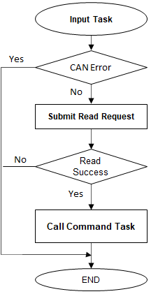

# CAN Bootloader Firmware Update mode execution flow

## Bootloader Task Flow

- Bootloader task is the main task which calls the Input sub-tasks in a forever loop.

- It calls the Input task to poll for command packets from host

- Once complete packet is received **Input Task** calls **Command task** to process the received command

- If the command received was a data command **Command task** calls **Flash Task** to flash the application

    

        
    

## Input Task Flow

- This task is used to receive the data bytes from embedded host

- The task keeps polling for data to be received when bootloader is in idle mode

- Once the packet reception is completed it gives control to **Command Task**

    

        
    

## Command Task Flow

- The task first validates the incoming packet from host with expected header information

- The task processes the commands received from **Input Task** and provides response back to host accordingly

- If the command received is a **Data command** it gives control to the **Flash Task**

    

        
    

## Flash Task Flow

- This task is responsible to program the internal flash memory with data packet received

- The task uses the NVM peripheral library to perform the Unlock/Erase/Write Operations

    

        
    

