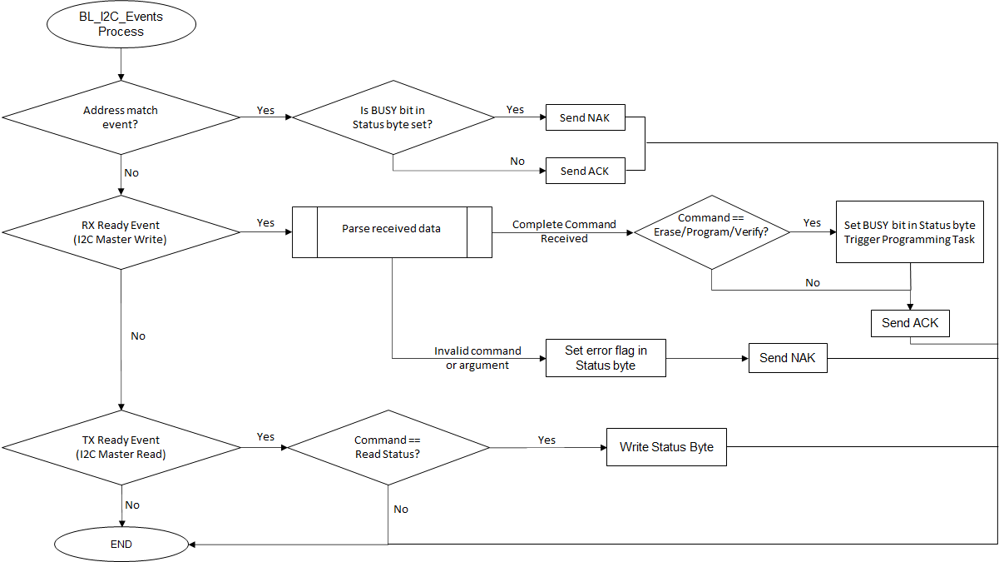

# I2C Bootloader Firmware Update mode execution flow

There are two state machines. One state machine processes the I2C events, parses the recevied I2C packets and triggers flash operations. The second state machine performs the flash operations (read/write/verify).

## Bootloader I2C Events Processor Task Flow

- Bootloader I2C Events Processor Task polls and processes the I2C events.

- This task is responsible for parsing and responding to the bootloader commands

- Once complete packet is received it sets the BUSY flag in the status byte and also sets appropriate flags for the Flash Programming Task to execute the command (Erase/Program/Verify)

    

        
    

## Flash Programming Task Flow

- This task is responsible for executing the Erase/Program and Verify commands

- This task is non-blocking. It submits a Erase/Program request and then checks the status of flash operation whenever it gets a chance to run

- Once the flash operation is complete, it clears the BUSY flag and sets appropriate error flags (if any) in the status byte.

    

        
    

