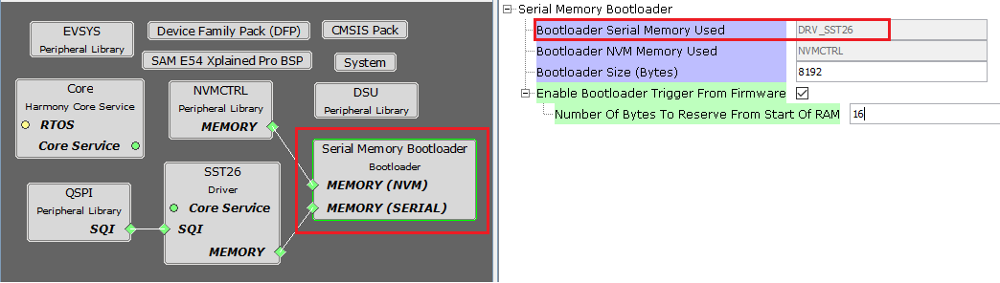
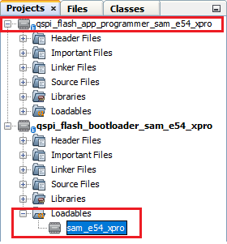

# Serial Memory Bootloader Configurations

## Bootloader Specific User Configurations

    

- **Bootloader Serial Memory Used:**
    - Specifies the Serial memory driver used by bootloader to receive the application
    - The name of the serial memory will vary based on the driver connected to bootloader

- **Bootloader NVM Memory Used:**
    - Specifies the memory peripheral used by bootloader to perform flash operations
    - The name of the peripheral will vary from device to device

- **Bootloader Size (Bytes):**
    - Specifies the maximum size of flash required by the bootloader
    - This size is calculated based on Bootloader type and Memory used
    - This size will vary from device to device and should always be aligned to device erase unit size

- **Enable Bootloader Trigger From Firmware:**
    - This Option can be used to Force Trigger bootloader from application firmware after a soft reset. It does so by reserving the specified number of bytes in SRAM from the start of the RAM. The reserved memory is updated by the application with a pre-defined pattern. The bootloader firmware in the [bootloader_Trigger()](./serial_bootloader_library_interface.md#bootloader_trigger) routine, can check the reserved memory for the pre-defined pattern and enter bootloader mode if the pattern matches.

    - **Number Of Bytes To Reserve From Start Of RAM:**
        - This option adds the provided offset to RAM Start address in bootloader linker script.
        - Application firmware can store some pattern in the reserved bytes region from RAM start for bootloader to check at reset in [bootloader_Trigger()](./serial_bootloader_library_interface.md#bootloader_trigger) function

## Bootloader System Configurations

    

- **Application Start Address (Hex):**
    - Start address of the application which will programmed by bootloader
    - This value is filled by bootloader when its loaded which is equal to the bootloader size. It can be modified as per user need
    - This value will be used by bootloader to Jump to application at device reset

## Bootloader MPLAB X Settings

- As the Serial memory may not have any valid binary **required by bootloader** for the first time, Adding the **application to be bootloaded as loadable** allows MPLAB X to create a **unified hex file** and program both these applications in their respective memory locations
    - By doing this, At first bootup bootloader directly jumps to application as the serial memory does not have any valid binary

    

        
    

## Additional Information

- Refer to [MIPS Bootloader Linker Script Configurations](../../../../mips/docs/mips_bootloader_linker_config.md) for information on bootloader linker script generated by MHC for MIPS based MCus

- Refer to [Bootloader Sizing And Considerations](../../../../docs/bootloader_sizing_and_considerations.md) for information on bootloader size change considerations
