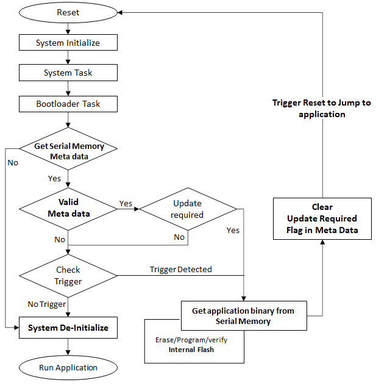

# Serial Memory Bootloader execution flow

- On device reset after systme initialize, The Bootloader task starts executing from the SYS_Tasks()

- Once the Serial Memory driver is ready, it retrieves the **Meta Data** from serial memory
    - If any error in reading the Meta-Data it directly jumps [Run application](#run-application)

- It checks if the Meta Data read is valid using the **Prologue and Epilogue**.
    - **If valid**
        - It stores the application start address and application size from meta data which will be used during programming operation

        - Checks if the **Update Required flag** is set. If set it jumps to [Programming](#programming) step **Or** continues to [Trigger Check](#trigger-check)

    - **If Invalid**
        - It continues to [Trigger Check](#trigger-check)

### Trigger Check

- If there are no conditions to enter the firmware upgrade mode, the Bootloader jumps to [Run application](#run-application)
    - Refer to [Bootloader Trigger Methods](../../../../docs/bootloader_trigger_methods.md) for different conditions to enter firmware upgrade mode

### Programming

- Starts reading the application binary from serial memory and perform erase/program operations on internal flash

- Once programming is completed, it generates CRC32 on programmed space of internal flash and verifies it against the CRC32 value stored in Meta data

- Once verification is complete it clears the **update required flag** in meta data and triggers reset to [Run application](#run-application)

### Run Application

- The application start address used to jump to application space can be
    - Application start address generated during compile time **Or**

    - Application start address retrieved from **valid Meta Data**

- Calls **SYS_DeInitialize()** function to release resources used

- Jumps to application space to run the updated application

    

