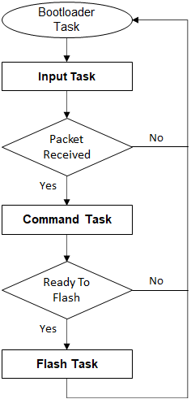
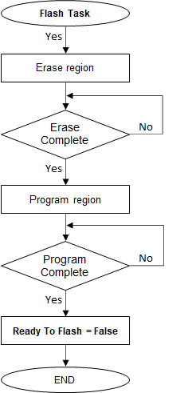

# UART Bootloader Firmware Update mode execution flow

## Bootloader Task Flow

- Bootloader task is the main task which calls the 3 sub-tasks in a forever loop.

- It always calls the Input task to poll for command packets from host

- Once complete packet is received it calls Command task to process the received command

- If the command received was a data command it calls programming task to flash the application

    

        
    

## Input Task Flow

- This task is used to receive the data bytes from host PC

- If there are valid GUARD bytes received at start of packet it proceeds further to receive the whole packet or else reports error and waits for next command

- All bytes of the command frame must be sent within 100 ms of each other. After 100 ms of idle time, incomplete command is discarded and bootloader goes back to waiting for a new Command.

- This behavior allows host to re-synchronize in the case of synchronization loss.

    

        
    

## Command Task Flow

- This task processes the packet received for supported commands

- If the received command is a DATA command, it sets **ready_to_flash flag** so that the bootloader task can call **Flash task**

    

        
    

## Flash Task Flow

- This task performs flash operations on the received data

### For CORTEX-M based MCUs

- As the bootloader is running from RAM, While waiting for flash operations to complete it calls **Input task** to receive the next command in parallel

    

        
    

### For MIPS based MCUs

    

