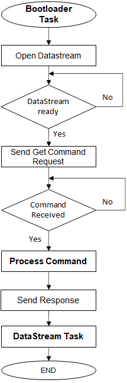
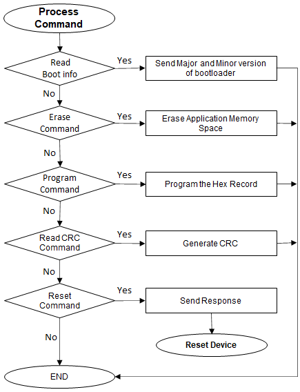

# UDP Bootloader Firmware Update mode execution flow

## Bootloader Task Flow

- Erases the Flash memory 

- Programs the hex file records into Flash memory 

- Jumps to the Application 

- Calls the DataStream Task at end of its every state machine execution to receive any packet from the Host PC 

    

        
        
    

## DataStream Task Flow

- This task is used to receive data bytes from host PC and to send response to host PC 

- It notifies the Bootloader task on completion of Data Reception or data transmit through callback 

    

        
    

