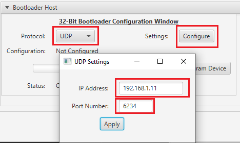

# UDP Bootloader Unified Host Script Help

## Downloading the host script

To clone or download these host tools from Github,go to the [main page of this repository](https://github.com/Microchip-MPLAB-Harmony/bootloader) and then click Clone button to clone this repo or download as zip file. This content can also be download using content manager by following [these instructions](https://github.com/Microchip-MPLAB-Harmony/contentmanager/wiki)

### Path of the tool within the repository is **tools/UnifiedHost-\*/UnifiedHost-\*.jar**

### Version and Support information

- Refer to **tools/UnifiedHost-\*/readme.txt** for information on versions and known issues if any

- **UART Protocol** is not supported in Harmony 3 using this tool

## Description

- This host script should be used to communicate with the UDP Bootloader running on the device

- It implements the Unified bootloader protocol required to communicate from host PC

- It sends the **Normalized Hex File** of the application to be bootloaded

## Configuring and Using the Unified Host tool

- Configure the Host PC for setting up IP Address to communicate with the device
    - Go to **Control Panel/Network and Internet/Network Connections**
    - Open **Ethernet properties**

    

        
    

    - Double Click on **Internet Protocol Version 4 (TCP/IPv4)**

    

        
    

    - Configure the IP Address as shown below
        - **IP address : 192.168.1.12**
        - **Subnet Mask : 255.255.255.0**

    

        
    

- Double click on **tools/UnifiedHost-\*/UnifiedHost-\*.jar** file to launch the Host application

- Select the **Device architecture** and **Protocol** as shown below

    

        
    

- Select **UDP Protocol**
    - Click on configure button to configure UDP port Number and IP Address

    

        
    

- Load the test application hex file to be programmed using below option

    

        
    

- Open the **Console** window of the host application to view application bootloading sequence

    

        
    

- Click on **Program Device** button to program the loaded test application hex file on to the device

    

        
    

- Following snapshot shows output of successfully programming the test application

    

        
    

## Using Unified Host Tool in debugging mode

- Launch Windows Command prompt in **tools/UnifiedHost-\*/** directory

- Run below command to launch Unified Host Application in debugging mode

      java -Djava.util.logging.config.file="logging.properties" -jar UnifiedHost-*.jar

- Once the tool is launched refer to steps mentioned above in [Configuring and Using the Unified Host tool](#configuring-and-using-the-unified-host-tool) to program application hex

- You can see the logs during programming sequence on the command prompt

- Once done you can open the **tools/UnifiedHost-\*/app.log** file and check for the programming sequence logs
