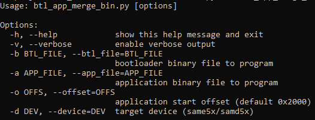

[](https://www.microchip.com)

# Bootloader and Application binary merge script Help

This document describes the usage of **btl_app_merge_bin.py** host script

## Downloading the host script

To clone or download these host tools from Github,go to the [main page of this repository](https://github.com/Microchip-MPLAB-Harmony/bootloader) and then click Clone button to clone this repo or download as zip file. This content can also be download using content manager by following [these instructions](https://github.com/Microchip-MPLAB-Harmony/contentmanager/wiki)

### Path of the tool within the repository is **tools/btl_app_merge_bin.py**

## Setting up the Host PC

- The Script is compatible with **Python 3.x**
    - For **Python 2.7.x** use the host scripts placed in **tool_archive/**. These scripts may be removed in future

## Description

- This script should be used to merge the bootloader binary and application binary
- It creates a merged binary output where bootloader is placed from start and the application will be placed at the offset passed as parameter
- If the application offset is not equal to end of bootloader offset it fills the gap with 0xFF until the application offset
- The merged binary can be used by btl_host.py as input for Updating bootloader and application together
- The merged binary will be created in the directory from where the script was called

    

## Usage Examples

### Below is the syntax to show help menu for the script

```
python <harmony3_path>\bootloader\tools\btl_app_merge_bin.py --help
```



### Below is the syntax and an example on how to merge a bootloader binary and application binary

```
python <harmony3_path>\bootloader\tools\btl_app_merge_bin.py -o <Offset> -b <Bootloader_binary_path> -a <Application_binary_path>
```

```
python <harmony3_path>\bootloader\tools\btl_app_merge_bin.py -o 0x2000 -b <harmony3_path>\bootloader_apps_uart\apps\uart_fail_safe_bootloader\bootloader\firmware\sam_e54_xpro.X\dist\sam_e54_xpro\production\sam_e54_xpro.X.production.bin -a <harmony3_path>\bootloader_apps_uart\apps\uart_fail_safe_bootloader\test_app\firmware\sam_e54_xpro.X\dist\sam_e54_xpro\production\sam_e54_xpro.X.production.bin
```


```
python <harmony3_path>\bootloader\tools\btl_host.py -v -s -i COM18 -d same5x -a 0x80000 -f <Path_to_merged_binary>\btl_app_merged.bin
```


